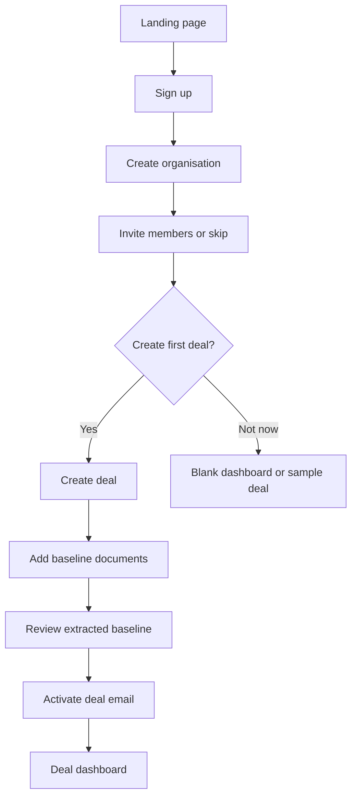
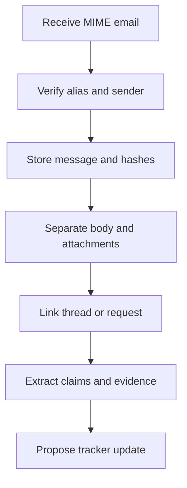
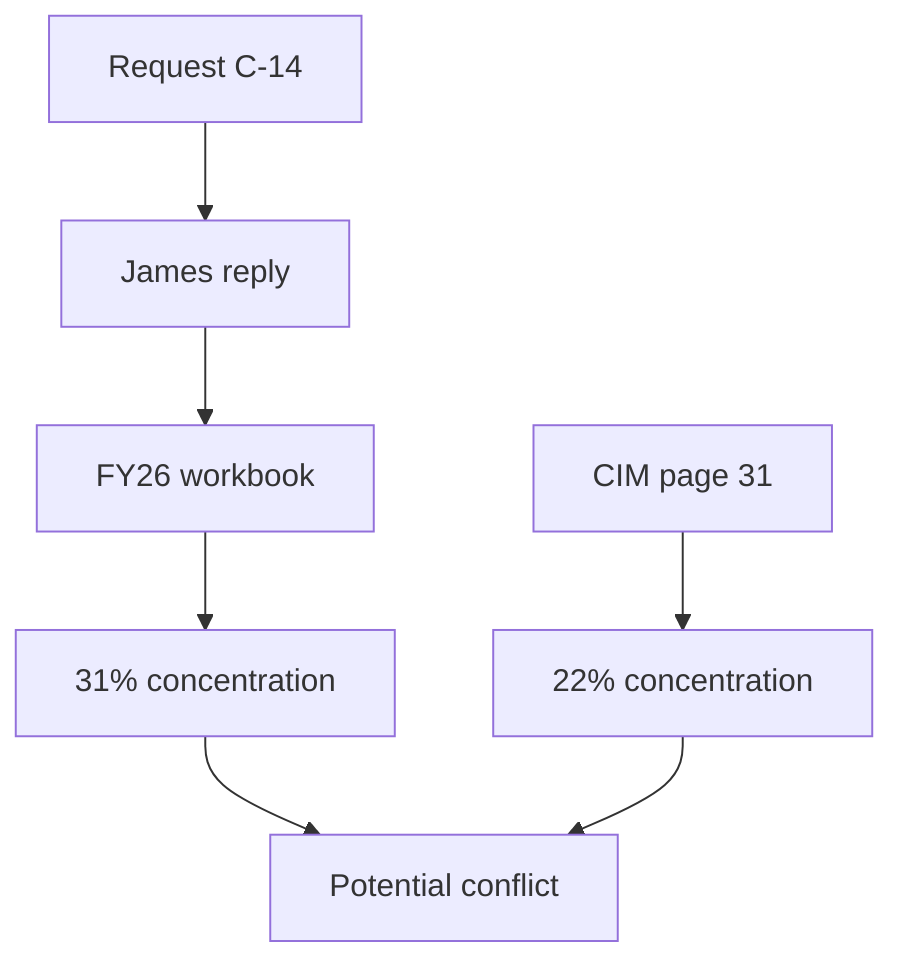
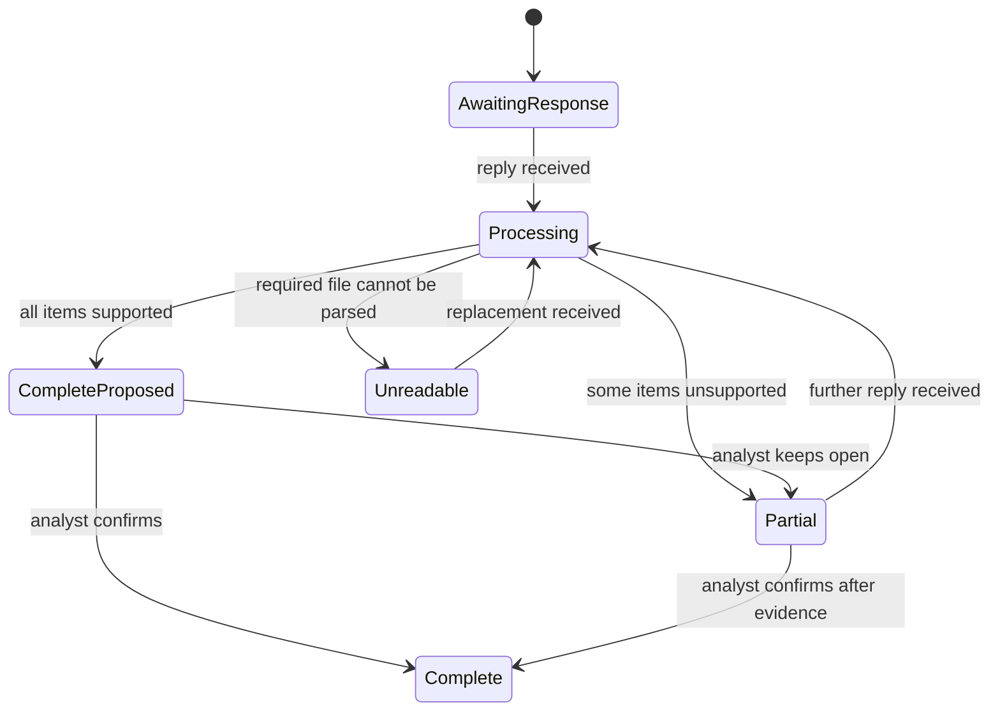
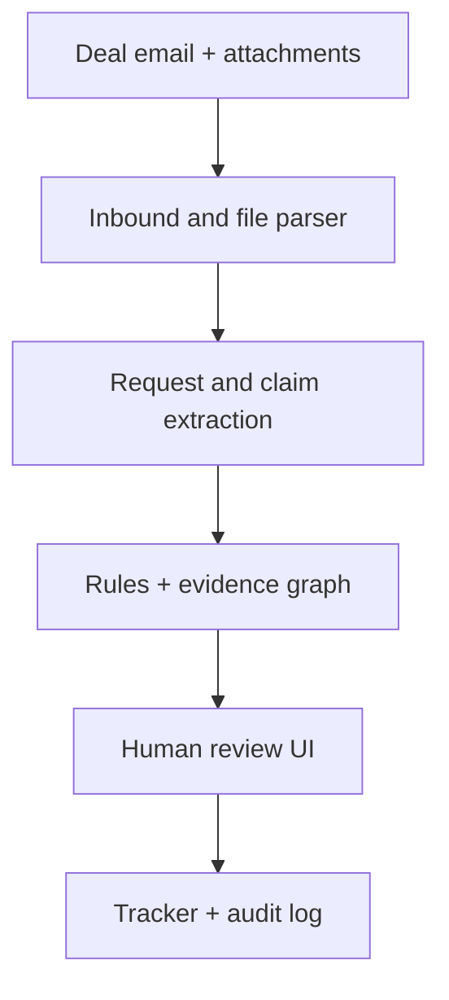

# CC’d: the diligence tracker you keep in the loop

**Tagline:** CC the deal. We will keep the diligence tracker current.  
**DRI:** Rochak Agarwal | **Track:** New products for real fund-manager problems  
**Status:** Define | **Created:** 2026-09-05 | **Last updated:** 2026-09-05  
**Build constraint:** Four-hour hackathon | **Design approach:** Code-first  
**Engineering plan:** Written after this PRD is locked | **Analytics:** Event schema defined; implementation optional for the prototype

**Document lineage:** This document defines the problem, product boundary, user experience, input flow, decision rules and demo contract. Once an engineering implementation plan is approved, that plan becomes the execution source of truth. The product hypothesis has not yet been validated through direct interviews with private-equity deal teams.

---

## A note to the team building this

CC’d succeeds only if it feels like an addition to a habit the deal team already has—not another system they must remember to maintain.

The user should continue composing an ordinary email to management or an adviser. The only visible addition is a deal-specific address in CC. From that point, CC’d should:

1. know which deal owns the conversation;
2. recognise the diligence request;
3. inspect the reply and every attachment;
4. decide whether the request appears complete, partial, contradictory or still unanswered;
5. propose the appropriate tracker update;
6. retain the evidence and decision history;
7. interrupt the analyst only when judgment is needed.

The product is not an email summariser. It is the reconciliation layer between deal communication, received evidence and the diligence tracker.

If you read only five sections, read **The one-paragraph version**, **Non-negotiables**, **Detailed user flow**, **Attachment input flow**, and **The five-minute demo**.

---

> **Confidence tags**
>
> 🟢 Directly verified or deterministic product rule  
> 🟡 Supported by secondary or vendor-published evidence  
> 🔵 Product hypothesis requiring customer validation  
> 🔴 Contradicted or deliberately rejected

---

## The one-paragraph version

**ICP:** associates and senior associates on small-to-mid-market private-equity deal teams conducting active diligence through email and an Excel-like request tracker.  
**Problem:** a reply arriving does not mean a diligence request was answered. Analysts manually connect emails and attachments to open requests, check whether every requested item was provided, identify contradictions and update the tracker.  
**Product:** a team creates a deal, uploads a small set of baseline documents and receives a unique CC’d email address. The baseline establishes the investment thesis, known risks, metrics and open requests once; ongoing emails and attachments then keep that state current. CC’d converts the existing conversation into evidence-linked tracker updates for human approval.  
**North Star:** the share of incoming deal responses correctly reconciled to an open diligence request and approved without the analyst manually editing the tracker.  
**Aha moment:** management has replied and attached a file, but CC’d shows—in one glance—that two requested items remain missing and one number conflicts with prior evidence.

---

## Changelog

| Change | Date | Owner | Comment |
|---|---|---|---|
| Initial CC’d PRD | 2026-09-05 | Rochak | Adapted to a four-hour fund-manager hackathon |
| Attachment evidence flow added | 2026-09-05 | Rochak | Email body and attachments treated as separate evidence objects |
| First-time onboarding and lifecycle flows added | 2026-09-05 | Rochak | Signup, organisation, invitations, baseline documents, empty states, access, correction and archive flows made explicit |

---

# PART A: WHY

## 1. The problem

Private-equity deal teams receive diligence questions, management responses and supporting evidence across long email threads and attachments. Analysts must manually match each response to the correct request, update the diligence tracker, verify that the requested evidence was actually provided and reconcile answers that contradict earlier information.

This leaves trackers outdated and creates a risk that incomplete, unsupported or conflicting information reaches the investment committee unnoticed. 🔵

### 1.1 Narrowed problem statement

> **Private-equity deal teams manually convert fragmented email responses and attachments into diligence-tracker updates, making it easy to mistake “responded” for “answered” and miss absent evidence or contradictory claims.**

### 1.2 The existing habit

The common workflow already has three parts:

1. The deal team sends questions over email.
2. Management and advisers reply, often with attachments.
3. An analyst updates an Excel or platform-based diligence tracker.

CC’d does not replace email, the tracker, advisers or the investment committee process. It removes the manual reconciliation between steps 2 and 3.

### 1.3 A real scenario

An analyst emails the target CFO:

> Please provide the top ten customer contracts and revenue by customer for FY25 and FY26.

Management replies:

> Please see the attached customer schedule. The commercial team is compiling the contracts. Customer concentration remains stable.

The reply contains `Customer_Revenue_FY26.xlsx`, but no contracts and no FY25 data. The spreadsheet also shows that the largest customer increased from 22% to 31% of revenue.

Today, the analyst has to:

- open the email;
- download and inspect the workbook;
- remember exactly what the original request asked for;
- compare the workbook with earlier information;
- decide whether the answer is complete;
- update the tracker;
- draft a follow-up;
- retain a defensible record of why the issue was raised.

CC’d should turn that response into:

```text
Response received — review required

Provided:
✓ FY26 revenue by customer

Still missing:
✕ Top ten customer contracts
✕ FY25 revenue by customer

Possible contradiction:
Largest-customer concentration changed from 22% to 31%.
```

### 1.4 The breakdown you can watch

The manual loop is:

`send request → wait → receive reply → inspect body → open attachments → find the tracker row → compare requested versus received → update status → identify gaps → draft follow-up`

The operational problem is not reading one email. It is keeping the request, answer, attachment, claim, review decision and current tracker state aligned over many exchanges.

### 1.5 Evidence

| Evidence | Magnitude | What it supports | Confidence |
|---|---:|---|---|
| Thomson Reuters customer survey | Inadequate technology contributed to more than 20% of due-diligence delays | Diligence tooling affects delivery time | 🟡 |
| Edge Connect survey of 150 PE-backed businesses | 90% relied on manual Excel input for investor reporting | Private-market data reconciliation is still manual | 🟡 |
| Same Edge Connect research | Finance teams spent an average of 45 days per year on investor reporting | Manual collection and reconciliation has meaningful opportunity cost | 🟡 |
| Same research | More than half relied on email to manage investor data requests | Email remains a formal information channel in private markets | 🟡 |
| V7 mid-market diligence estimate | 5,000–12,000 documents, 200–400 questions and 8–15 workstreams | Diligence has enough volume and concurrency to create tracking risk | 🟡 |
| Cross-channel contradiction frequency | No reliable public benchmark found | Exact incidence still needs primary research | 🔵 |

**Evidence caveat:** the strongest public figures demonstrate manual private-market reporting and complex M&A diligence; they do not directly measure this exact response-to-tracker workflow. The product wedge remains a hypothesis to validate with deal-team interviews.

Sources: [Thomson Reuters](https://legalsolutions.thomsonreuters.co.uk/blog/2024/01/25/how-to-modernize-m-a-due-diligence-reviews/), [Edge Connect survey summary](https://www.linkedin.com/pulse/navigating-portfolio-data-management-private-equity-edge-connect-ai-3nyjc), [V7 diligence analysis](https://www.v7labs.com/blog/ma-due-diligence).

### 1.6 Why now

- Email remains embedded in the workflow. 🔵
- Modern models can convert messages and files into structured claims and requested items. 🟢
- Deterministic email metadata can route a message to a deal without asking AI to guess. 🟢
- Page, sheet and cell references can keep extracted findings inspectable. 🟢
- Human approval can protect high-stakes tracker and investment decisions. 🟢

> **Key insight**
>
> A response is an event. An answer is a verified state.

---

## 2. Target user

### 2.1 Primary user

**Private-equity associate or senior associate** working on an active transaction.

| Behaviour | Current reality | Product implication |
|---|---|---|
| Sends diligence questions over email | Email is already habitual | CC’d must sit inside the thread |
| Maintains or contributes to a request tracker | Status is manually reconciled | Updates must map to a specific tracker item |
| Reviews PDFs and spreadsheets | Evidence often lives in attachments | Attachments are first-class inputs |
| Works across parallel workstreams | Context is fragmented | Findings need deal and workstream context |
| Escalates material issues to a VP | Not every update deserves interruption | Alert on exceptions, not every message |
| Needs defensible sourcing | Claims may affect investment decisions | Every finding needs provenance and history |

### 2.2 Secondary user

**Vice president or deal lead** who wants to know:

- which items remain materially unresolved;
- what changed since the last review;
- whether evidence supports management’s answers;
- which issues require escalation before IC.

### 2.3 Economic buyer hypothesis

Head of investment operations, deal-team partner, COO or technology lead at a private-equity firm. 🔵

### 2.4 Not for

- LP allocation decisions;
- fund accounting or NAV calculation;
- capital-call administration;
- broad enterprise email surveillance;
- generic legal document review;
- automated investment approval;
- communication unrelated to an authorised deal.

---

## 3. Existing ecosystem and its ceiling

| Tool | What works | What remains manual | Ceiling |
|---|---|---|---|
| Email | Universal communication and attachments | Mapping a reply to a diligence item | Knows threads, not diligence state |
| Excel/Sheets tracker | Flexible and familiar | Manual status, links and follow-ups | Becomes stale between edits |
| Virtual data room | Secure files, permissions and Q&A | Information still arrives outside the room | Does not reconcile all communication |
| Generic AI assistant | Can summarise supplied content | Requires someone to select and provide context | No persistent deal state or audit history |
| Project-management tool | Owners and deadlines | Evidence completeness and contradictions | Tracks tasks, not truth claims |

The common ceiling is that communication systems know messages, while trackers know rows. Neither understands whether a specific response and its attachments actually satisfy a specific request.

---

## 4. Operational impact

| Failure | Operational effect | Deal risk |
|---|---|---|
| Reply marked complete without all requested evidence | False closure | Missing information reaches IC |
| Attachment not linked to tracker item | Repeated search and review | Slower diligence |
| Revised number not compared with previous claim | Assumptions drift | Model or memo becomes inconsistent |
| New response not reflected in tracker | Stale status | Duplicate follow-ups and confusion |
| Decision buried in email | Weak handover | Review cannot be reconstructed |

The hackathon prototype will demonstrate these effects rather than claim an unvalidated financial saving.

---

## 5. Problem prioritisation

| Problem | Impact | Effort | Priority |
|---|---:|---:|---|
| Route an authorised email to the correct deal | High | Low | P0 |
| Recognise a new diligence request | High | Medium | P0 |
| Match a reply to the originating request | High | Medium | P0 |
| Inspect attachments as evidence | High | Medium | P0 |
| Compare requested items with supplied items | High | Medium | P0 |
| Flag one contradictory metric | High | Medium | P0 |
| Propose, approve and audit a tracker update | High | Medium | P0 |
| Send alerts inside existing email habit | Medium | Medium | P1/demo simulation |
| Synchronise an external Excel tracker | Medium | High | Defer |
| Support all mailbox and VDR providers | Medium | High | Defer |

**The product loop:** request copied to CC’d → response and attachment received → completeness checked → exception reviewed → tracker state approved → audit history retained.

---

## 6. Key assumptions

| Assumption | Evidence | Confidence |
|---|---|---|
| Deal teams will tolerate adding one address in CC | Not validated | 🔵 |
| A mail rule or shared distribution list can later remove even that action | Technically feasible | 🟢 |
| Email replies can be matched through headers and thread identifiers | Standard email behaviour | 🟢 |
| Users value “partial” as distinct from “responded” | Core product hypothesis | 🔵 |
| Attachments contain a material share of requested evidence | Strong workflow observation; not quantified here | 🟡 |
| Human approval is acceptable for material updates | Product-risk assumption | 🔵 |
| A visible source trail increases trust | Product hypothesis | 🔵 |

---

## 7. The approach at a high level

Every deal receives a unique, secure email address. Authorised deal-team members include it in CC or an existing mail rule copies it automatically. CC’d uses the address to route the message deterministically, reads the body and attachments, maintains a structured record of questions and claims, and proposes tracker updates. The analyst reviews only incomplete, unsupported or contradictory items.

---

## 8. Goals and success

### Product goal

Turn an ordinary diligence email exchange into an accurate, evidence-linked tracker update without asking the analyst to duplicate the work.

### North Star

**Approved reconciliation rate:** percentage of received deal responses that are correctly matched to an open request and approved without a manual tracker edit.

### Prototype success

The five-minute demo must complete this chain:

`ordinary email → deterministic deal routing → request extraction → attachment parsing → response evaluation → human approval → tracker update → audit verification`

### Aha moment

The tracker initially shows **Response received**. CC’d opens the attached workbook and changes the proposed state to **Partial — evidence missing**, while also highlighting a contradictory concentration metric with a sheet and cell reference.

---

## 9. Success criteria

| Criterion | Prototype target | Kill signal | Type |
|---|---|---|---|
| Deal routing | 100% for messages sent to a unique deal alias | AI has to guess the deal | Guardrail |
| Request creation | New outbound request becomes a tracker item | User retypes the request | Primary |
| Thread matching | Reply connects to the originating request | User manually searches the tracker | Primary |
| Attachment provenance | Finding shows filename plus page or cell | Claim has no inspectable source | Guardrail |
| Completeness | Demo response is correctly marked partial | Any attachment causes automatic completion | Primary |
| Contradiction | 22% versus 31% is surfaced | Difference remains buried | Primary |
| Human control | User approves before closure or material update | AI silently closes the item | Guardrail |
| Auditability | Full event chain verifies | Actions cannot be reconstructed | Guardrail |
| AI degradation | Raw request and response still render if AI fails | Entire tracker becomes unavailable | Guardrail |

---

## 10. Hypotheses

| H# | Hypothesis | Kill signal | Test |
|---|---|---|---|
| H1 | Adding a deal address is a small enough behaviour change | Team repeatedly forgets to include it | Interview and usage test |
| H2 | “Answered versus responded” is a valuable distinction | Analysts already track completeness effortlessly | Show the incomplete-response prototype |
| H3 | Source-linked findings are trusted more than summaries | Users ignore citations and inspect files from scratch | Observe review behaviour |
| H4 | Exception-only alerts reduce tracker work | Alerts create more review work than they save | Measure approve/edit/reject rates |
| H5 | Attachments can be matched reliably enough to requested evidence | File relevance requires extensive manual interpretation | Test representative packs |
| H6 | An internal knowledge graph improves contradiction detection | Graph adds no value beyond a flat tracker | Compare detection cases |

---

## 11. Non-goals

- Reading every employee email.
- Replacing Gmail, Outlook or the virtual data room.
- Automatically sending external emails.
- Automatically closing material diligence items.
- Performing full financial, legal, commercial or tax diligence.
- Rebuilding the financial model.
- Supporting scanned handwriting or arbitrary legacy formats.
- Becoming the official system of record during the prototype.
- Production-grade regulatory retention or immutable storage.
- Authentication, multi-tenant administration or enterprise deployment in the four-hour build.

---

# PART B: WHAT

## 12. Product concept

### Name

# **CC’d**

### Tagline

> **The diligence tracker you keep in the loop.**

### Behavioural instruction

> **CC the deal. We will keep the tracker current.**

### Why the name works

- It describes the smallest user action.
- It is memorable and slightly playful without sounding unserious.
- It makes the demo explain itself.
- It reinforces that the product joins an existing conversation.

### One-line product description

CC’d turns authorised deal emails and attachments into evidence-linked diligence-tracker updates, flagging incomplete answers and contradictory claims for human review.

### The inversion

| Traditional diligence tooling | CC’d |
|---|---|
| User visits another system | Product joins the existing thread |
| Tracks whether someone replied | Tests whether the request was answered |
| Treats attachments as files | Treats attachments as evidence |
| User searches previous messages | System connects claims over time |
| AI summary is the output | Human-approved tracker state is the output |

---

## 13. Product operating model

### 13.1 One secure address per deal

Production-style example:

```text
northstar-acme@in.ccd.app
atlas-acme@in.ccd.app
```

Hackathon example using Gmail plus-addressing:

```text
ccdiligence.demo+northstar@gmail.com
ccdiligence.demo+atlas@gmail.com
```

The alias determines the deal. AI is not asked to guess routing when the address is present.

### 13.2 Who may send information

Each deal has an authorised-sender policy:

- approved organisation domains;
- named deal-team users;
- approved management and adviser addresses;
- optional quarantine for unknown senders.

The unique address is a routing key, not a security credential.

### 13.3 How the address enters the thread

| Mode | Behaviour change | Product phase |
|---|---|---|
| User adds deal address in CC | One small repeated action | Hackathon |
| Email rule copies relevant messages | None after setup | V-next |
| Existing project distribution list includes CC’d | None after setup | V-next |
| Shared deal mailbox connection | None after setup | Later |

### 13.4 What CC’d may do

| Automatic | Suggested for approval | Always human-controlled |
|---|---|---|
| Route by deal address | Match an ambiguous new thread | Confirm material contradiction |
| De-duplicate messages/files | Change tracker status | Close a request |
| Preserve source metadata | Identify missing evidence | Update IC materials |
| Link standard email replies | Draft follow-up | Send external email |
| Hash evidence and events | Assign materiality | Dismiss a finding |

### 13.5 Two input phases, one deal memory

CC’d has two deliberately different input phases:

| Phase | User behaviour | Purpose |
|---|---|---|
| Baseline setup | Upload or connect a small set of existing deal documents once | Establish thesis, known risks, metrics and open requests |
| Ongoing monitoring | Continue normal deal emails with the unique address copied | Keep requests, evidence and claims current |

The baseline is not a recurring upload workflow. It gives later emails something reliable to update or challenge. The system must preserve whether a fact came from a baseline document, an email body, an attachment or a human decision.

Recommended baseline sources:

1. IC or screening memo;
2. diligence request tracker;
3. CIM or management presentation;
4. financial model or forecast summary;
5. optional financial, commercial or legal diligence reports.

No single document is mandatory. The product exposes reduced coverage when a category is missing instead of blocking the user.

---

## 14. Non-negotiables

| Rule | Why |
|---|---|
| CC’d never reads the whole company mailbox | Privacy and trust |
| Deal routing uses the unique address first | Determinism before AI |
| Email body and every attachment are separate evidence objects | A reply can contain weak or conflicting evidence |
| “Attachment received” never means “request complete” | Relevance and coverage must be checked |
| AI never silently closes a diligence item | High-stakes human control |
| Every extracted claim has a source locator | Findings must be inspectable |
| Every status change records actor, reason and prior state | Auditability |
| Unsupported files remain visible as unreadable | No false confidence |
| The core demo works from seeded email data | External integration cannot sink the demo |

---

## 15. Key features

### P0: required for the four-hour prototype

| # | Feature | Description |
|---:|---|---|
| 1 | First-time onboarding | Landing, simulated signup, organisation setup and skippable invitation step |
| 2 | Deal creation | Create one deal or deliberately enter a sample deal |
| 3 | Baseline setup | Add prepared IC memo, tracker and supporting source files |
| 4 | Baseline review | Confirm extracted metrics, risks and requests before monitoring |
| 5 | Deal workspace | Generated email alias plus team-visible dashboard |
| 6 | Email inbox simulator or Gmail sync | Import authorised deal messages |
| 7 | Deterministic deal routing | Resolve deal from recipient alias |
| 8 | Request extraction | Turn an outbound diligence question into a tracker item |
| 9 | Thread matching | Link a reply to its originating request |
| 10 | PDF attachment extraction | Capture text with page provenance |
| 11 | XLSX attachment extraction | Capture values with sheet and cell provenance |
| 12 | Completeness check | Compare requested items against response and evidence |
| 13 | One contradiction check | Compare a new metric with the confirmed baseline |
| 14 | Review queue | Show partial, missing and contradictory responses |
| 15 | Human approval | Approve, edit or reject the proposed update |
| 16 | Audit timeline | Record ingestion, AI and user actions |
| 17 | Evidence graph | Visualise request → response → evidence → finding → decision |

### P1: add only if P0 works

- Email-formatted alert preview.
- Draft follow-up response.
- Daily deal brief.
- Second deal to demonstrate deterministic routing.
- Downloadable or copied tracker view.
- Functional invitation email and acceptance.

### P2: explicitly deferred

- Outlook and Slack ingestion.
- VDR integration.
- Direct Google Sheets or Excel synchronisation.
- Background push notifications.
- OCR for scanned documents.
- DOCX, PPTX, ZIP and image attachments.
- Production authentication and user/role administration.
- Automatic email sending.
- Cross-deal portfolio insight.

---

## 16. User experience principles

1. **Work arrives to the user.** The analyst should not routinely visit CC’d to check whether something happened.
2. **Show exceptions, not activity.** A normal complete response can update quietly after approval; incomplete or contradictory responses deserve attention.
3. **Evidence before explanation.** Show the relevant quote, page, sheet or cell before AI prose.
4. **One decision per screen.** Confirm the proposed tracker state, request follow-up or dismiss the finding.
5. **Never hide uncertainty.** Confidence, unreadable inputs and ambiguous matches must be visible.
6. **Preserve the familiar tracker metaphor.** The user already understands rows, owners, statuses and deadlines.
7. **Keep the graph optional.** It is a powerful inspection surface, not homework for the analyst.

---

# 17. DETAILED USER FLOW

This section is the primary product contract.

## 17.0 Actors in the primary journey

| Actor | Role in the journey |
|---|---|
| Priya, PE associate | Sends requests and reviews proposed updates |
| James, target CFO | Replies and supplies evidence |
| Maya, deal VP | Reviews material exceptions |
| CC’d | Routes, extracts, evaluates, proposes and records |
| Email provider | Delivers messages and attachments |

## 17.1 First-time user journey

The canonical first-time flow is:



The flow has three promises:

1. The user understands the product before granting access or adding data.
2. No optional setup step becomes a dead end.
3. The first dashboard tells the user exactly what to do next.

### 17.1.1 Landing page

#### User goal

Understand the value in under ten seconds and decide whether to begin.

#### Page content

```text
CC’d

The diligence tracker you keep in the loop.

CC the deal-specific address on the emails your team already sends.
CC’d checks the replies and attachments, flags missing or conflicting
evidence, and proposes an auditable tracker update.

[Start tracking a deal]   [Explore a sample deal]
```

#### Supporting proof strip

```text
Email-native     Attachment-aware     Human-approved     Source-linked
```

#### Product illustration

Show one simple before/after, not a generic dashboard screenshot:

```text
Management replied + attached a workbook
                         ↓
Response is partial · 3 items missing · 1 potential conflict
```

#### User actions

- **Start tracking a deal** → signup.
- **Explore a sample deal** → read-only Northstar workspace with no signup in a production acquisition flow; for the hackathon it may enter the simulated app directly.
- Sign in → returning-user flow.

#### Analytics

- `landing_primary_cta_clicked`
- `sample_deal_clicked`
- `signin_clicked`

#### Exit condition

The user either begins signup, explores the sample or leaves. There is no request for documents or mailbox access on the landing page.

---

### 17.1.2 Signup

#### User goal

Create an account with minimal friction.

#### Fields

- Work email — required.
- Password — required only for email/password mode.
- Full name — required.
- Google or Microsoft work sign-in — preferred production options.

#### Screen

```text
Create your CC’d account

Work email      priya@acmecapital.com
Full name       Priya Shah
Password        ••••••••••••

[Create account]

or

[Continue with Google] [Continue with Microsoft]
```

#### Validation and edge cases

| Condition | Behaviour |
|---|---|
| Personal email domain | Allow for prototype; explain that work email is recommended |
| Email already has an account | Offer sign-in and password recovery |
| Pending organisation invitation exists | Join invited-member flow instead of creating a duplicate organisation |
| Verification email required | Preserve entered data and resume after verification |
| Provider sign-in cancelled | Return to signup without losing context |

#### System actions

- create user record;
- check for an outstanding invitation;
- derive a suggested organisation name from the email domain where possible;
- record account-creation audit event.

#### Prototype behaviour

The four-hour build presents a functional form and persists local state. It does not need production authentication.

#### Exit condition

New uninvited user continues to **Create organisation**. Invited user continues to **Accept invitation**.

---

### 17.1.3 Create organisation

#### User goal

Establish the workspace that will own deals, members and access rules.

#### Fields

- Organisation name — required.
- Work domain — suggested from signup email; editable.
- Organisation type — private equity, private credit, venture capital, family office or other.
- User role — analyst/associate, senior associate, VP/director, partner, operations, other.

#### Example

```text
Set up your organisation

Organisation name       Acme Capital
Work domain              acmecapital.com
Organisation type       Private equity
Your role                Associate

[Create organisation]
```

#### Why organisation type is collected

It controls language and future templates, not access. The P0 experience remains private-equity-specific.

#### System actions

- create organisation;
- make creator the organisation admin;
- create default member and deal-access policies;
- store organisation domain as one sender-verification signal;
- create `ORGANISATION_CREATED` and `ROLE_ASSIGNED` events.

#### Error states

| Condition | Behaviour |
|---|---|
| Domain already belongs to an organisation | Offer request-to-join, never silently join |
| Organisation name exists elsewhere | Permit it; names are not unique identifiers |
| Domain and work email differ | Explain and require confirmation |
| Save fails | Preserve fields and offer retry |

#### Exit condition

The user owns a valid organisation workspace and continues to member invitations.

---

### 17.1.4 Invite organisation members

#### User goal

Optionally bring collaborators into the organisation before creating a deal.

#### Screen

```text
Invite your team

Email                            Organisation role
maya@acmecapital.com             Member
sam@acmecapital.com              Member

[+ Add another]  [Send invitations]

[Skip for now]
```

#### Organisation roles

| Role | Organisation permissions |
|---|---|
| Admin | Manage organisation, members and deal creation |
| Member | Access only deals explicitly assigned |

Deal-specific roles are assigned later. Inviting someone to the organisation does not expose every deal.

#### Skip behaviour

Selecting **Skip for now** is legitimate. It takes the user to the first-deal decision and adds a dismissible onboarding task:

```text
Invite collaborators when you are ready
```

#### Invitation states

- Draft
- Sent
- Accepted
- Expired
- Revoked

#### Prototype behaviour

The four-hour build stores invitees locally and shows a success state. It does not need to send real invitation emails.

#### Audit events

- `MEMBER_INVITED`
- `MEMBER_INVITE_SKIPPED`

#### Exit condition

The user either records invitations or deliberately skips them; both paths converge on first-deal creation.

---

### 17.1.5 First-deal decision

#### Principle

“Skip deal creation” must not silently drop the user onto an unexplained blank page. Present an explicit choice:

```text
How would you like to begin?

[Create my first deal]
Set up a real workspace and receive a deal-specific CC address.

[Explore Project Northstar]
See a complete example before adding deal information.

[Go to empty dashboard]
Create a deal later.
```

#### Recommended default

Emphasise **Create my first deal**. The sample is secondary. The empty dashboard is tertiary.

#### Why there are three choices

- Create deal supports users ready to act.
- Sample deal supports users who need to understand the output first.
- Empty dashboard respects users who want to configure members or settings before sharing deal data.

#### Audit events

- `FIRST_DEAL_STARTED`
- `SAMPLE_DEAL_OPENED`
- `FIRST_DEAL_DEFERRED`

---

### 17.1.6 Organisation dashboard with no deal

#### Entry condition

The user deferred deal creation and did not enter the sample.

#### Empty state

```text
Welcome to Acme Capital

No deals are being tracked yet.

Create a deal to establish a baseline, receive a secure CC address
and start tracking responses and evidence.

[Create first deal]  [Explore sample deal]
```

#### Secondary content

- invited members and their status;
- a concise “How CC’d works” three-step panel;
- organisation settings link.

#### Prohibited content

- zero-filled charts;
- “0 material changes” presented as an achievement;
- sample metrics presented as the user’s real data;
- a disabled dashboard with no explanation.

#### Exit condition

The user starts deal creation, explores the sample or leaves with a clear return path.

---

### 17.1.7 Post-deal setup checklist

After the deal record and alias are created, the user lands on a setup checklist rather than the mature dashboard.

```text
Set up Project Northstar                         1 of 4 complete

✓ Deal created
○ Add baseline documents                        Recommended
○ Review extracted baseline                     Required after upload
○ Activate the deal email                       Required for monitoring
○ Add deal members                              Optional

[Continue setup]
```

#### Rules

- Progress persists if the user leaves.
- Optional steps never block activation.
- Required steps explain why they are required.
- If documents are skipped, email monitoring can still begin, but contradiction coverage is visibly limited.
- The address exists immediately after deal creation, but the activation step explains and tests it.

---

### 17.1.8 Baseline-document selection

#### User goal

Give CC’d enough current deal context to recognise changes without making onboarding feel like data-room migration.

#### Introduction

```text
Establish the baseline

Add the documents your team already relies on. CC’d will use these
as the current source for the investment thesis, known risks, key
metrics and open requests. You can add more later.
```

#### Guided document checklist

| Category | Suggested document | Why it matters | Required? |
|---|---|---|---:|
| Investment case | IC memo or screening memo | Thesis, assumptions and known concerns | No; recommended |
| Open work | Diligence request tracker | Existing requests, owners and states | No; recommended |
| Management claims | CIM or management presentation | Baseline narrative and forecast claims | No; recommended |
| Financial baseline | Model or forecast summary | Revenue, EBITDA, debt and scenario metrics | No; recommended |
| Specialist work | QoE, commercial or legal report | Workstream findings and evidence | No |

#### Upload UI

```text
IC or screening memo
[Drop PDF here] [Choose file]

Diligence request tracker
[Drop XLSX/CSV here] [Choose file]

CIM or management presentation
[Drop PDF here] [Choose file]

Financial model or forecast
[Drop XLSX here] [Choose file]

[Add another document]

[Process 3 documents]  [Do this later]
```

#### Input rules

- Multiple files may be chosen together.
- The user selects or confirms a document category.
- PDF, XLSX, CSV and TXT are supported in P0.
- Maximum prototype size and count are displayed before upload.
- Every file receives its own state and warning.
- No document is labelled “portfolio”; the product asks for a precise category.

#### Skip behaviour

Selecting **Do this later** shows a confirmation:

```text
Continue without baseline documents?

CC’d can still track new requests and responses, but it will have
less context for identifying changed or contradictory claims.

[Continue with limited coverage] [Return to upload]
```

The dashboard then carries a visible **Limited baseline coverage** banner with an action to add documents.

---

### 17.1.9 Baseline upload and processing

#### Per-file lifecycle

```text
SELECTED → UPLOADING → VALIDATING → PARSING → EXTRACTING → READY
```

Alternative states:

- Needs category
- Duplicate
- New version detected
- Password protected
- Unsupported
- Parse failed

#### Processing screen

```text
Building the Northstar baseline                    2 of 3 ready

Northstar_IC_Memo.pdf              Ready
24 claims · 6 risks · 3 assumptions

Northstar_Diligence_Tracker.xlsx   Ready
34 requests · 12 open · 7 owners

Northstar_Forecast.xlsx            Reading Base Case sheet…

[Continue when ready]
```

#### Behaviour

- Ready files may be reviewed while another file processes.
- Failure of one file does not discard successful files.
- User may remove a file before confirming the baseline.
- Source hashes and parse warnings are retained.
- A new file with the same hash is marked duplicate.
- A changed file with the same name is treated as a possible version.

#### Exit condition

At least one file is ready or the user explicitly continues with limited coverage.

---

### 17.1.10 Baseline review and confirmation

#### User goal

Confirm the high-value state that future communications will update or challenge.

#### Summary screen

```text
Review the Northstar baseline

Investment case
• Recurring-revenue growth supports a premium entry multiple
• Customer concentration is a known commercial risk

Key metrics
FY27 revenue growth                         18%
Adjusted EBITDA FY26                      £14.2m
Net debt                                   £47m
Largest customer concentration              22%

Request tracker
34 total · 12 awaiting response · 5 partial · 17 complete

Warnings
• Forecast workbook contains 2 hidden sheets
• 3 tracker rows have no owner

[Confirm baseline] [Review sources] [Edit selected values]
```

#### Review behaviour

The user does not need to approve every extracted sentence. Require explicit review only for:

- key metrics used in the demo;
- open request count and statuses;
- warnings that limit future comparisons;
- source files treated as current versions.

#### Available actions

- Confirm item.
- Edit value or unit.
- Change period.
- Exclude item from comparisons.
- Open source page/sheet/cell.
- Replace document.
- Continue with warning.

#### Human-control rule

Unconfirmed extracted content may be searchable, but only confirmed or explicitly designated baseline claims may trigger high-severity contradiction alerts.

#### On confirmation

- create accepted baseline claims;
- create document, claim, metric, request and source graph nodes;
- record user corrections;
- mark setup task complete;
- create `BASELINE_CONFIRMED` audit event.

---

### 17.1.11 Activate the deal email

#### User goal

Understand how ongoing information reaches CC’d and verify the route.

#### Screen

```text
Keep Project Northstar current

Add this address in CC on Northstar deal conversations:

northstar-acme@in.ccd.app                         [Copy]

CC’d will:
✓ assign messages to Project Northstar
✓ link replies to open requests
✓ inspect attached evidence
✓ compare new claims with the confirmed baseline
✓ propose updates for your team to approve

[I have copied the address] [Send test message]
```

#### Optional production setup

- Add address to existing deal distribution list.
- Ask an administrator to create a forwarding rule.
- Connect a shared deal mailbox.

These are later modes; the prototype demonstrates the copied-address model.

#### Test-message flow

1. Product presents a prepared subject and recipient.
2. User sends or simulates an email containing the deal alias.
3. CC’d receives it.
4. UI confirms sender verification and Northstar routing.
5. No diligence finding is created from the test message.

#### Success state

```text
✓ Deal email active
Test message received and routed to Project Northstar.
```

#### Failure states

| Failure | Action |
|---|---|
| No message received | Check address, retry or skip test |
| Wrong alias | Show received alias and correct copy action |
| Sender not authorised | Add approved sender or use organisation email |
| Connector unavailable | Activate seeded demo mode |

---

### 17.1.12 Add deal members

Organisation membership and deal access are separate.

#### Screen

```text
Who should access Project Northstar?

Priya Shah       Deal member
Maya Patel       Deal lead
Sam Lee          Viewer

[Add organisation member]
[Finish setup]
```

#### Deal roles

| Role | Deal permissions |
|---|---|
| Deal lead | Review, approve, escalate, manage deal access |
| Deal member | Review and propose tracker changes |
| Viewer | Read deal state and evidence only |

The creator defaults to deal lead if nobody else is selected.

---

### 17.1.13 First dashboard arrival

#### Entry condition

The user finished or deliberately skipped setup steps.

#### Dashboard hierarchy

```text
PROJECT NORTHSTAR                         Confirmatory diligence

Setup
Baseline confirmed · Deal email active · 3 members

Needs attention
Nothing requires review yet.

Current diligence
12 awaiting response · 5 partial · 17 complete

Recent baseline
4 key metrics · 6 known risks · 5 source documents

[Copy deal email] [Send first tracked request]
```

#### If baseline was skipped

```text
Limited baseline coverage
CC’d can track requests and responses, but cannot reliably identify
changes against earlier documents until a baseline is added.

[Add baseline documents]
```

#### If deal email was not activated

```text
Ongoing monitoring is not active
Activate the Northstar deal address to track future responses.

[Activate deal email]
```

#### Visibility

The dashboard is visible only to organisation members assigned to the deal. “Visible to the whole team” means the authorised deal team, not every organisation member.

---

### 17.1.14 Hackathon demo state after onboarding

The seeded prototype ultimately produces:

- organisation: `Acme Capital`;
- deal: `Project Northstar`;
- deal stage: `Confirmatory diligence`;
- unique address: `ccdiligence.demo+northstar@gmail.com`;
- authorised internal user: `priya@acmecapital.test`;
- authorised external user: `james@northstar.test`;
- confirmed baseline from an IC memo and request tracker;
- three existing requests;
- one accepted claim: largest customer = 22%;
- an empty “new activity” queue.

Real authentication, invitation delivery and mailbox administration are simulated. The resulting records and transitions are real local application state.

---

## 17.2 First-time deal setup

### Entry condition

An authorised deal-team member wants CC’d to observe a new transaction.

### Screen: Deals

```text
Deals

Project Atlas             2 items need review

[+ Add a deal]
```

### User action

The user selects **Add a deal**.

### Screen: Create deal

Fields:

- Project name — required
- Target company — required
- Short deal code — generated, editable
- Stage — optional
- Deal owner — defaults to current user
- Internal sender domain — defaults to organisation domain

Example:

```text
Project name: Project Northstar
Target company: Northstar Software Ltd
Deal code: NORTHSTAR
Stage: Confirmatory diligence
Owner: Priya Shah
```

### Validation

| Condition | Behaviour |
|---|---|
| Project name blank | Disable creation and show inline message |
| Deal code already used | Suggest a unique suffix |
| Unsupported characters | Normalise the email-safe alias and preview it |
| Target company blank | Block creation |

### System action

CC’d creates:

- a deal record;
- a unique inbound alias;
- an empty request register;
- an empty evidence graph;
- an audit genesis event;
- default authorised-sender policy.

### Confirmation screen

```text
Project Northstar is ready

Your secure deal address:
ccdiligence.demo+northstar@gmail.com       [Copy]

Next, establish the current deal baseline and activate this address
for ongoing monitoring.

[Continue setup]  [Go to dashboard]
```

### Audit events

- `DEAL_CREATED`
- `DEAL_ALIAS_CREATED`
- `SENDER_POLICY_INITIALISED`

### Exit condition

The deal, alias and access boundary exist. The canonical next step is the post-deal setup checklist in §17.1.7.

### Hackathon shortcut

The creation form persists local state and then loads prepared Northstar files into the baseline-upload step. It does not provision a production email domain.

---

## 17.3 Starting a diligence request from ordinary email

### Entry condition

Priya is working in Gmail or Outlook—not in CC’d.

### User behaviour

Priya composes a normal email:

```text
To: james@northstar.test
CC: ccdiligence.demo+northstar@gmail.com
Subject: Northstar — customer concentration information

Hi James,

Please provide:
1. The top ten customer contracts;
2. Revenue by customer for FY25 and FY26; and
3. Current contract expiry dates.

Thanks,
Priya
```

### What the user does not do

- Open CC’d.
- Create a tracker row.
- Select a deal from a dropdown.
- Upload the email.
- Copy the question into another system.
- Describe which evidence is expected a second time.

### System behaviour after delivery

1. Email provider delivers a copy to the Northstar alias.
2. CC’d validates the alias and sender.
3. Deal is assigned deterministically from the alias.
4. Message is fingerprinted and stored.
5. Message direction is recognised as internal → external.
6. AI classifies it as a new diligence request.
7. The numbered list becomes three requested items.
8. A tracker item is created in **Awaiting response**.
9. A request node and requested-evidence nodes are added to the graph.
10. The audit events are appended.

### Tracker result

| ID | Request | Requested items | Owner | Status | Age |
|---|---|---:|---|---|---:|
| C-14 | Customer concentration information | 3 | James Miller | Awaiting response | 0d |

### User-visible confirmation

CC’d should not send a noisy email for every successful capture. A subtle confirmation may appear in the product activity feed:

```text
Request C-14 created from your email.
3 requested items · Awaiting response
```

### Audit events

- `EMAIL_INGESTED`
- `EMAIL_AUTHORISED`
- `EMAIL_ROUTED_TO_DEAL`
- `REQUEST_CLASSIFIED`
- `REQUEST_CREATED`
- `REQUEST_ITEM_CREATED` × 3

### Exit condition

The request exists in the tracker without manual duplicate entry.

---

## 17.4 Inbound email ingestion

### Trigger

The ingestion mailbox receives a message addressed to a deal alias.

### Processing sequence



### Deterministic checks before AI

| Check | Pass behaviour | Failure behaviour |
|---|---|---|
| Recipient contains known deal alias | Assign deal | Quarantine as unrouted |
| Sender is authorised | Continue | Quarantine as unknown sender |
| Message ID has not been processed | Continue | Ignore duplicate and log |
| MIME can be decoded | Continue | Mark ingestion error |
| Total attachment size within limit | Continue | Preserve metadata, mark oversized |
| File type allowed | Parse | Mark unsupported, never infer content |

### Stored raw source

- provider message ID;
- internet message ID;
- thread ID;
- `In-Reply-To` and `References` headers;
- sender and recipients;
- sent and received timestamps;
- subject;
- normalised body text;
- body content hash;
- attachment metadata and hashes;
- original-source deep link where available.

### Exit condition

The raw source is preserved and the message is either accepted, quarantined or rejected with an explicit reason.

---

## 17.5 Receiving a management response

### Entry condition

James selects **Reply all**, leaving the Northstar alias in the thread.

### Example response

```text
To: priya@acmecapital.test
CC: ccdiligence.demo+northstar@gmail.com
Subject: Re: Northstar — customer concentration information

Hi Priya,

Please see the attached customer schedule. The commercial team
is compiling the contracts. Customer concentration remains stable.

Best,
James

Attachment: Customer_Revenue_FY26.xlsx
```

### Immediate system behaviour

1. The deal alias maps the response to Project Northstar.
2. `In-Reply-To`, `References` and the thread ID map it to request C-14.
3. The response body and workbook are stored as separate sources.
4. The workbook enters attachment processing.
5. The tracker item changes internally to `RESPONSE_PROCESSING`; this transient state is not treated as completion.

### Processing UI

```text
Checking response to C-14

✓ Email received
✓ Thread matched
✓ 1 attachment secured
… Reading Customer_Revenue_FY26.xlsx
… Comparing against 3 requested items
```

### If processing takes longer

The user can leave the screen. The original tracker status remains **Awaiting response** with a small **Response processing** indicator; it must not temporarily display **Complete**.

### Exit condition

The body and attachment are parsed or explicitly marked unreadable, ready for completeness evaluation.

---

## 17.6 Attachment input flow

Attachments are first-class evidence. Each file travels through its own pipeline.

### 17.6.1 Attachment states

```text
RECEIVED
  → VALIDATING
  → STORED
  → PARSING
  → PARSED
  → EVIDENCE_MATCHED

Alternative terminal states:
  UNSUPPORTED
  UNREADABLE
  PASSWORD_PROTECTED
  OVERSIZED
  DUPLICATE
  PARSE_FAILED
```

### 17.6.2 File metadata captured before parsing

| Field | Example |
|---|---|
| Filename | `Customer_Revenue_FY26.xlsx` |
| MIME type | `application/vnd.openxmlformats-officedocument.spreadsheetml.sheet` |
| Size | 184 KB |
| Cryptographic hash | `sha256:…` |
| Parent message | `msg_103` |
| Sender | James Miller |
| Received at | 2026-09-05 09:42 UTC |
| Processing status | Parsing |

### 17.6.3 Supported prototype files

| File type | Prototype extraction | Evidence locator |
|---|---|---|
| PDF | Text-based page extraction | Filename, page, excerpt |
| XLSX | Workbook/sheet/cell extraction | Filename, sheet, cell/range |
| CSV | Header and row extraction | Filename, row and column |
| TXT | Plain text | Filename, line range |

### 17.6.4 Deferred files

- scanned PDFs requiring OCR;
- password-protected files;
- DOCX and PPTX;
- ZIP archives;
- images and screenshots;
- macros and executable content;
- external file-sharing links that require separate authentication.

The UI must show these files as received but unreadable—not silently discard them.

### 17.6.5 XLSX parsing

For `Customer_Revenue_FY26.xlsx`, CC’d:

1. lists workbook sheets;
2. selects relevant populated sheets;
3. preserves raw values and displayed values;
4. extracts headers and table ranges;
5. identifies period, metric and unit;
6. emits claims with sheet and cell provenance;
7. avoids executing formulas or macros;
8. records whether the value came from a formula cell or literal cell.

Example evidence:

```json
{
  "attachmentId": "att_201",
  "filename": "Customer_Revenue_FY26.xlsx",
  "sheet": "Customer Summary",
  "range": "A2:C12",
  "claim": {
    "subject": "largest_customer_concentration",
    "period": "FY26",
    "value": 0.31,
    "unit": "percentage_of_revenue"
  },
  "sourceCell": "C3"
}
```

### 17.6.6 PDF parsing

For a text-based PDF, CC’d:

1. extracts text page by page;
2. retains page boundaries;
3. produces short evidence excerpts;
4. attaches each claim to a page number;
5. never cites the entire document without a locator.

Example:

```json
{
  "filename": "FY27_Forecast_v3.pdf",
  "page": 7,
  "quote": "FY27 revenue growth has been revised to 12%.",
  "claim": {
    "subject": "revenue_growth",
    "period": "FY27",
    "value": 0.12
  }
}
```

### 17.6.7 Evidence relevance evaluation

Receiving an attachment satisfies nothing by itself. For each requested item, CC’d assigns:

| Result | Meaning |
|---|---|
| Supported | Relevant evidence contains the requested information |
| Partially supported | File contains some but not all required fields or periods |
| Mentioned only | Email or file claims something without underlying evidence |
| Irrelevant | File does not address the request |
| Unreadable | File arrived but could not be inspected |
| Missing | No candidate evidence arrived |

### 17.6.8 Body-versus-attachment contradiction

If the email says “concentration remains stable” but the workbook shows 31% versus a previous 22%, CC’d does not choose a winner. It creates a conflict containing both sources.

### 17.6.9 Attachment version handling

| Situation | Behaviour |
|---|---|
| Same hash, different filename | Treat as duplicate binary |
| Same filename, different hash | Create a new version |
| Filename includes `v2` or `revised` | Capture hint, but verify content hash |
| New file supersedes old evidence | Preserve both and add `SUPERSEDES` edge |
| Formula value changes | Store displayed value and flag formula provenance |

### 17.6.10 Attachment card UI

```text
Customer_Revenue_FY26.xlsx                    Parsed

Matched to: Revenue by customer — FY26
Coverage: 1 of 3 requested items

Key evidence:
Largest customer concentration              31%
Source: Customer Summary!C3

[Open evidence] [Mark unrelated]
```

### Exit condition

Every attachment has a visible processing state, source hash and zero or more inspectable evidence matches.

---

## 17.7 Comparing requested versus received

### Input

Requested items from C-14:

1. Top ten customer contracts.
2. Revenue by customer for FY25 and FY26.
3. Current contract expiry dates.

Response evidence:

- body says contracts are being compiled;
- workbook provides FY26 customer revenue;
- workbook includes no FY25 sheet;
- workbook includes no contract expiry dates;
- no contract files are attached.

### Coverage matrix

| Requested item | Email body | Attachment | Evaluation |
|---|---|---|---|
| Top ten customer contracts | Future promise | None | Missing |
| Revenue by customer FY25 | Not mentioned | None | Missing |
| Revenue by customer FY26 | “Attached schedule” | Workbook table | Supported |
| Contract expiry dates | Not mentioned | None | Missing |

### Proposed overall status

`PARTIAL_RESPONSE_EVIDENCE_MISSING`

### Product explanation

> A response and one workbook were received. The workbook provides FY26 revenue by customer, but the requested contracts, FY25 customer revenue and contract expiry dates were not supplied.

### Rule

The overall request cannot become **Complete** while any required item is missing, unreadable or awaiting human judgment.

---

## 17.8 Checking new claims against prior evidence

### Existing accepted claim

```text
Largest customer concentration · FY25 · 22%
Source: CIM, page 31
Accepted by Priya on 2 September
```

### New claim

```text
Largest customer concentration · FY26 · 31%
Source: Customer_Revenue_FY26.xlsx, Customer Summary!C3
```

### Period-aware logic

22% in FY25 and 31% in FY26 are not automatically a factual contradiction because the periods differ. The conflict arises because management’s current email says concentration **remains stable** while the supplied data indicates a nine-percentage-point increase.

CC’d should present:

```text
Potential narrative-to-data conflict

Management statement:
“Customer concentration remains stable.”

Supplied evidence:
Largest customer share increased from 22% in FY25 to 31% in FY26.

Why this needs review:
The latest data does not appear consistent with the description “stable.”
```

### Guardrail

The system labels this **Potential conflict** until an analyst confirms it. It does not accuse management of misrepresentation.

### Graph changes

- email `CONTAINS_CLAIM` stable concentration;
- workbook `SUPPORTS_METRIC` 31%;
- CIM `SUPPORTS_METRIC` 22%;
- claim `POTENTIALLY_CONFLICTS_WITH` metric trend;
- finding `AFFECTS` commercial-risk topic.

---

## 17.9 Generating the review item

### Trigger

Completeness or contradiction evaluation yields an exception.

### Finding created

```text
Finding F-009
Customer evidence incomplete; concentration statement needs review

Severity: High — suggested
Status: Needs analyst review
Related request: C-14
Sources: 1 email, 1 workbook, 1 previous CIM claim
```

### Review-queue card

```text
HIGH · COMMERCIAL                                  New

Customer response is incomplete

1 of 4 requested evidence components supplied.
Management’s “stable concentration” statement may conflict
with an increase from 22% to 31%.

[Review 3 sources]
```

### Sorting

Review queue order:

1. confirmed or potential contradiction affecting a material metric;
2. unreadable attachment blocking a critical request;
3. missing required evidence;
4. partial answer;
5. ambiguous routing or matching;
6. complete low-risk response awaiting batch approval.

---

## 17.10 Alerting without creating a new habit

### Principle

CC’d sends no alert for routine ingestion. It notifies the user only when a decision is needed or in a scheduled digest.

### Prototype alert surface

An email-styled alert preview inside the product:

```text
From: CC’d <alerts@ccd.app>
To: Priya Shah
Subject: Northstar — one response needs review

Management replied to C-14, but the request appears incomplete.

PROVIDED
✓ FY26 revenue by customer

MISSING
✕ Top ten customer contracts
✕ FY25 revenue by customer
✕ Contract expiry dates

POTENTIAL CONFLICT
“Concentration remains stable” versus 22% → 31%.

[Review evidence]
```

### Production behaviour

The button deep-links to finding F-009. The user does not navigate from a generic dashboard.

### Notification rules

| Event | Immediate alert | Daily digest only |
|---|---:|---:|
| High-impact potential contradiction | Yes | Also included |
| Critical unreadable attachment | Yes | Also included |
| Partial response | No | Yes |
| Complete response | No | Summary only |
| Administrative email | No | No |

---

## 17.11 Reviewing a finding

### Entry condition

Priya clicks **Review evidence** from the alert or queue.

### Screen layout

The review experience uses three columns.

#### Left: request and thread

```text
C-14 · Customer concentration

2 Sep — Priya requested 4 evidence components
5 Sep — James replied with 1 attachment

Requested items
○ Customer contracts
○ FY25 revenue by customer
● FY26 revenue by customer
○ Contract expiry dates
```

#### Centre: proposed tracker update

```text
PROPOSED STATUS
Partial — evidence missing

WHY
Only FY26 revenue by customer was supplied.

POTENTIAL CONFLICT
“Stable concentration” versus 22% → 31%.

Suggested next action
Request the three missing evidence components and clarification
of the customer-concentration change.
```

#### Right: evidence inspector

Tabs:

- Email
- Workbook
- Previous evidence
- Audit

Workbook evidence:

```text
Customer_Revenue_FY26.xlsx
Customer Summary · C3

Largest Customer Ltd     £9.3m     31%

[Open surrounding rows]
```

### Primary decisions

- **Approve as partial**
- **Edit proposed update**
- **Request follow-up**
- **Mark complete** — requires reason when missing evidence exists
- **Dismiss conflict** — requires reason
- **Escalate to deal lead**

### Default emphasis

The strongest visual action is **Approve as partial**. The interface must not nudge the user toward completion.

### On approval

1. Tracker status becomes **Partial — evidence missing**.
2. Three sub-items remain open.
3. Evidence is linked to the supported FY26 sub-item.
4. Potential conflict remains open unless separately resolved.
5. User, timestamp and optional note are stored.
6. Audit and graph are updated.

### Confirmation

```text
Tracker updated

C-14 remains open with 3 missing items.
Your decision and supporting evidence were recorded.

[Draft follow-up]
```

---

## 17.12 Drafting a follow-up

### Entry condition

Priya selects **Draft follow-up**.

### AI input

- original request;
- received response;
- supported and missing items;
- potential conflict;
- recipient and subject context;
- instruction not to invent facts.

### Generated draft

```text
Subject: Re: Northstar — customer concentration information

Hi James,

Thanks for the FY26 customer schedule. To complete request C-14,
could you please also provide:

1. The top ten customer contracts;
2. Revenue by customer for FY25; and
3. Current contract expiry dates.

The schedule shows the largest customer increasing from 22% of
revenue in FY25 to 31% in FY26. Could you also explain the change
and confirm how management defines “stable concentration” here?

Thanks,
Priya
```

### User actions

- Copy draft
- Edit draft
- Return to finding

### P0 constraint

CC’d does not send the email. Sending stays in the user’s existing email client.

### Audit events

- `FOLLOWUP_DRAFT_GENERATED`
- `FOLLOWUP_DRAFT_COPIED` if instrumented

---

## 17.13 Receiving the second response

### Example

James replies with:

- `Top_10_Contracts.pdf`;
- `Customer_Revenue_FY25.xlsx`;
- `Contract_Expiries.csv`;
- explanation that the largest customer completed an acquisition, temporarily increasing reported concentration.

### System processing

1. Thread maps to C-14.
2. Three attachments are fingerprinted and parsed independently.
3. Evidence is mapped to the three remaining sub-items.
4. The explanation is stored as a new claim, not accepted fact.
5. The system proposes **Complete — analyst confirmation required**.
6. The potential conflict is proposed as **Explained**, not automatically resolved.

### Review state

```text
C-14 may now be complete

✓ Top ten customer contracts
✓ FY25 revenue by customer
✓ FY26 revenue by customer
✓ Contract expiry dates

Concentration change explanation received.

[Confirm complete] [Keep open]
```

### Human decision

Priya reviews representative evidence and selects **Confirm complete**.

### Result

- request status becomes **Complete**;
- reviewer and timestamp are recorded;
- all evidence remains linked;
- conflict becomes **Explained — accepted by Priya**;
- audit chain adds final decision events.

---

## 17.14 Returning-user flow

### Entry points

The analyst normally returns through:

1. an exception email;
2. a daily brief;
3. a direct link shared by a colleague;
4. the deal list before an internal meeting.

### Deal overview

```text
PROJECT NORTHSTAR                         Confirmatory diligence

Since your last review
12 messages · 6 attachments · 3 tracker updates

Needs attention
2 potential conflicts
3 incomplete responses
1 unreadable attachment

Request status
18 complete · 7 partial · 9 awaiting response
```

### Primary action

**Review 6 exceptions**

The dashboard must not lead with vanity counts such as total emails processed. It should lead with decisions required.

---

## 17.15 Daily brief flow

### Trigger

Scheduled summary at the user’s selected time. This is P1 and may be simulated in the prototype.

### Brief content

```text
PROJECT NORTHSTAR — DAILY DILIGENCE BRIEF

Since yesterday
• 7 responses received
• 4 requests ready to close
• 2 incomplete responses
• 1 potential contradiction

Highest-priority issue
Largest-customer concentration increased from 22% to 31%, while
management described it as stable.

Oldest unanswered requests
• Cyber remediation plan — 8 days
• Customer contracts — 6 days
• Updated insurance schedule — 5 days

[Review Northstar]
```

### Guardrail

The brief links every claim to the underlying finding. It must not become a free-floating AI narrative.

---

## 17.16 Evidence graph flow

### Purpose

The graph helps a reviewer answer: **Why does CC’d believe this request is incomplete or contradictory?**

### Default graph scope

Open only the selected finding’s neighbourhood, not the entire deal graph.



### Node interactions

| Node | On click |
|---|---|
| Request | Show original email and requested items |
| Response | Show body and metadata |
| Attachment | Show parsing status and preview |
| Claim/metric | Show exact source locator |
| Finding | Show evaluation and current state |
| Decision | Show actor, timestamp and rationale |

### User value

The user never edits the graph. It is a visual index of provenance and reasoning.

---

## 17.17 Audit-trail flow

### Entry

From the finding’s **Audit** tab or the deal-level **Activity and decisions** page.

### Timeline

```text
2 Sep 09:12  Priya sent request C-14
2 Sep 09:12  CC’d extracted 4 requested evidence components
5 Sep 09:42  James replied with 1 attachment
5 Sep 09:42  Attachment hash recorded
5 Sep 09:43  Workbook parsed: Customer Summary!A2:C12
5 Sep 09:43  FY26 revenue evidence linked
5 Sep 09:43  3 required evidence components still missing
5 Sep 09:43  Potential concentration conflict created
5 Sep 09:51  Priya approved “Partial — evidence missing”
5 Sep 09:52  Follow-up draft generated
```

### Filters

- Sources
- AI analysis
- Human decisions
- Tracker changes
- Attachment processing
- Errors and overrides

### Verification indicator

```text
✓ Event chain verified · 21 events
```

### Accuracy of claim

The prototype is **tamper-evident**, not immutable or compliance-certified.

---

## 17.18 Deal-lead escalation flow

### Trigger

Priya selects **Escalate to deal lead** on a high-impact finding.

### Result

- finding owner changes to Maya;
- proposed materiality and analyst note are included;
- no external email is sent;
- a shareable internal link is produced;
- audit captures the escalation.

### Deal-lead view

```text
Decision requested from Maya

Issue: Customer concentration increased 22% → 31%
Management description: “remains stable”
Analyst recommendation: Request explanation; update downside case

[Accept recommendation] [Return to analyst] [Mark immaterial]
```

---

## 17.19 End state of the primary journey

The loop is complete only when:

- the original request remains identifiable;
- all received messages and attachments are retained as sources;
- each requested item has a visible evidence state;
- the tracker reflects a human-approved status;
- contradictions are resolved or explicitly left open;
- the entire sequence can be reconstructed from the audit trail.

---

## 17.20 Invited-member journey

### Entry condition

Maya receives an organisation invitation from Priya.

### Flow

```text
Open invitation
→ verify invited email
→ sign in or create account
→ accept organisation membership
→ see assigned deals
→ open Project Northstar
→ review “Since you joined” summary
```

### Invitation page

```text
Priya Shah invited you to Acme Capital on CC’d

Organisation role: Member
Deal access: Project Northstar · Deal lead

[Accept and continue]
```

### Existing-account path

Sign in, verify that the account email matches the invitation and accept. Do not create a second user.

### New-account path

Collect name and authentication method, then accept. Do not ask the invitee to create another organisation.

### First deal view

```text
Welcome to Project Northstar

Since the baseline was established:
• 7 responses received
• 2 findings need deal-lead review
• 3 tracker updates approved by Priya

[Review assigned findings]
```

### Edge cases

| Condition | Behaviour |
|---|---|
| Invitation expired | Request a new invitation |
| Invitation revoked | Explain that access is no longer available |
| Signed in with different email | Ask user to switch account; do not expose metadata |
| Organisation member but no deal access | Show organisation shell without Northstar |
| Deal access removed during session | End deal session and return to authorised deal list |

---

## 17.21 Source-document update flow

This flow applies when a user manually adds a later baseline document or an email attachment appears to supersede a current source.

### Trigger

CC’d receives `Northstar_Forecast_v3.xlsx` after `Northstar_Forecast_v2.xlsx` was designated current.

### System behaviour

1. Hash both files and confirm that content differs.
2. Detect probable shared document family from filename, structure and context.
3. Preserve both versions.
4. Extract comparable claims with periods and units.
5. calculate exact numeric deltas in code;
6. separate material candidates from informational changes;
7. ask the user whether v3 becomes the current baseline.

### UI

```text
A new forecast version was received

Current                         Candidate
Northstar_Forecast_v2.xlsx     Northstar_Forecast_v3.xlsx

5 changes need review
12 informational changes

[Compare changes] [Make v3 current] [Keep both active]
```

### Rules

- Newer timestamp alone never proves that a file supersedes another.
- Original sources remain accessible after supersession.
- Making a file current does not automatically accept every extracted claim.
- Material changes require review; non-material changes may be batch accepted.
- The decision adds `SUPERSEDES` and `DESIGNATED_CURRENT` graph edges and audit events.

---

## 17.22 Correction and override flow

### User need

Correct a wrong extraction, source link, request match, deal assignment or proposed status without destroying the original record.

### Correctable objects

- Deal assignment.
- Document category.
- Request/response relationship.
- Requested-item breakdown.
- Evidence relevance.
- Spreadsheet sheet/cell.
- PDF page/excerpt.
- Metric value, period or unit.
- Materiality.
- Proposed tracker status.

### Flow

```text
Open incorrect item
→ choose Correct
→ select correction type
→ enter corrected value or relationship
→ provide reason when material
→ preview downstream effect
→ confirm
```

### Example

```text
Correct extracted period

Current: FY26
Corrected: LTM Jun-26

This correction will remove one potential conflict because the periods
are no longer directly comparable.

Reason: Workbook header uses LTM reporting period.

[Confirm correction]
```

### Result

- Current graph and finding state update.
- Original proposal remains in audit history.
- Correcting a source link invalidates dependent evaluations and reruns them.
- Previously approved tracker state is not silently changed; a new proposal is created if necessary.

---

## 17.23 Deal-access management flow

### Entry condition

Organisation admin or deal lead opens **Deal settings → Access**.

### Actions

- Add an existing organisation member.
- Invite a new organisation member and pre-assign deal access.
- Change deal role.
- Remove access.
- Transfer deal lead.
- Review pending invitations.

### Removal warning

```text
Remove Sam Lee from Project Northstar?

Sam will lose access to messages, attachments, findings and audit history
for this deal. Decisions Sam previously made will remain in the audit trail.

[Remove access] [Cancel]
```

### Rules

- Organisation membership does not imply deal access.
- At least one deal lead must remain.
- Past decisions retain the historical actor identity.
- Removing access does not delete evidence.
- Access changes are audited.

---

## 17.24 Deal dashboard state matrix

| State | Primary message | Primary action |
|---|---|---|
| No organisation deals | No deals are being tracked | Create first deal |
| Deal created, no baseline | Establish current deal context | Add baseline documents |
| Baseline deliberately skipped | Monitoring active with limited comparison coverage | Add baseline documents |
| Documents uploading | Files are being secured | Stay or leave safely |
| Documents processing | Building the baseline | Review ready files |
| Baseline warnings | Some sources need attention | Resolve warnings |
| Baseline ready, email inactive | Activate ongoing monitoring | Activate deal email |
| Active, no findings | Nothing currently needs review | Copy deal email/send request |
| Active, findings present | Decisions required | Review exceptions |
| Connector unavailable | New email cannot be synchronised | Retry/use fallback |
| AI evaluation failed | Source retained; tracker unchanged | Retry review |
| Deal archived | Monitoring stopped; history retained | View audit history |

The dashboard never uses an empty chart to communicate missing setup.

---

## 17.25 Notification-preference flow

### User controls

- Immediate material alerts: on/off.
- Daily digest: time and timezone.
- Partial-response digest: on/off.
- Ageing-request threshold.
- Deal-specific mute.

### Defaults

- High-impact potential conflicts: immediate.
- Critical unreadable attachment: immediate.
- Partial responses: daily digest.
- Complete responses: no immediate alert.
- Administrative messages: never.

### Guardrail

Muting notifications never stops ingestion or audit recording. The UI clearly distinguishes **monitoring active** from **notifications muted**.

---

## 17.26 Deal completion and archive flow

### Trigger

The transaction closes, is declined, is paused or is otherwise no longer active.

### Status options

- Completed/acquired.
- Declined.
- Paused.
- Archived.

### Confirmation

```text
Archive Project Northstar?

New emails will no longer update this deal. Existing messages, evidence,
decisions and audit history will remain available to authorised members.

Deal address behaviour:
● Stop accepting new messages
○ Accept and quarantine new messages

[Archive deal] [Cancel]
```

### Result

- automatic processing stops;
- alias behaviour follows the selected policy;
- dashboard becomes read-only unless reactivated;
- active alerts and digests stop;
- evidence and audit history remain accessible;
- archive action and actor are recorded.

### Reactivation

Only a deal lead or organisation admin can reactivate. Reactivation does not automatically process messages that were rejected while archived.

---

# 18. INPUT FLOW AND INFORMATION MODEL

## 18.1 Inputs to the product

| Input | Source | Required for P0 |
|---|---|---:|
| User and organisation profile | First-time onboarding | Simulated |
| Deal configuration | Product setup | Yes |
| Deal-specific inbound alias | Generated | Yes |
| Baseline IC/CIM documents | One-time deal setup | Prepared sample |
| Baseline request tracker | One-time deal setup | Prepared sample |
| Baseline financial workbook | One-time deal setup | Prepared sample |
| Email metadata and body | Inbound mailbox or fixture | Yes |
| Attachments | MIME email | Yes |
| Existing request context | Confirmed baseline and prior CC’d emails | Yes |
| Existing accepted claims | Confirmed baseline and later evidence | Yes |
| Reviewer decisions | Product UI | Yes |
| External Excel tracker | Integration | No |

## 18.2 Normalised email object

```json
{
  "id": "msg_103",
  "dealId": "deal_northstar",
  "source": "gmail",
  "providerMessageId": "18df92",
  "internetMessageId": "<abc@northstar.test>",
  "threadId": "thread_19",
  "inReplyTo": "<request@acmecapital.test>",
  "from": "james@northstar.test",
  "to": ["priya@acmecapital.test"],
  "cc": ["ccdiligence.demo+northstar@gmail.com"],
  "subject": "Re: Northstar — customer concentration information",
  "sentAt": "2026-09-05T09:42:00Z",
  "bodyText": "Please see the attached customer schedule...",
  "bodyHash": "sha256:…",
  "attachmentIds": ["att_201"]
}
```

## 18.3 Normalised attachment object

```json
{
  "id": "att_201",
  "messageId": "msg_103",
  "filename": "Customer_Revenue_FY26.xlsx",
  "mimeType": "application/vnd.openxmlformats-officedocument.spreadsheetml.sheet",
  "sizeBytes": 188416,
  "sha256": "sha256:…",
  "status": "PARSED",
  "parseWarnings": [],
  "evidenceIds": ["ev_401"]
}
```

## 18.4 Request object

```json
{
  "id": "C-14",
  "dealId": "deal_northstar",
  "title": "Customer concentration information",
  "sourceMessageId": "msg_089",
  "requestedFrom": "james@northstar.test",
  "requestedAt": "2026-09-02T09:12:00Z",
  "status": "PARTIAL_EVIDENCE_MISSING",
  "items": [
    {"id": "C-14.1", "label": "Top ten customer contracts", "required": true},
    {"id": "C-14.2", "label": "Revenue by customer FY25", "required": true},
    {"id": "C-14.3", "label": "Revenue by customer FY26", "required": true},
    {"id": "C-14.4", "label": "Current contract expiry dates", "required": true}
  ]
}
```

## 18.5 Evidence object

```json
{
  "id": "ev_401",
  "dealId": "deal_northstar",
  "attachmentId": "att_201",
  "supportsRequestItemId": "C-14.3",
  "locator": {
    "kind": "spreadsheet_cell",
    "sheet": "Customer Summary",
    "cell": "C3"
  },
  "displayValue": "31%",
  "rawValue": 0.31,
  "confidence": 0.97
}
```

## 18.6 Proposed update object

```json
{
  "id": "proposal_501",
  "requestId": "C-14",
  "previousStatus": "AWAITING_RESPONSE",
  "proposedStatus": "PARTIAL_EVIDENCE_MISSING",
  "supportedItems": ["C-14.3"],
  "missingItems": ["C-14.1", "C-14.2", "C-14.4"],
  "findingIds": ["finding_009"],
  "requiresHumanApproval": true
}
```

---

## 19. Deal routing logic

Routing priority:

1. Exact deal alias in To/CC/BCC-equivalent inbound envelope.
2. Existing email thread already assigned to a deal.
3. Explicit project reference or external deal system identifier.
4. Participant and subject inference—for suggestion only.
5. Human routing queue.

| Confidence | Behaviour |
|---:|---|
| Deterministic alias/thread match | Assign automatically |
| ≥90% inferred match | Propose assignment, visibly marked inferred |
| 60–89% | Require user confirmation |
| <60% or multiple candidates | Do not assign |

The hackathon uses only steps 1 and 2.

---

## 20. Request and response matching logic

Matching priority:

1. `In-Reply-To` points to the request email.
2. Email-provider thread ID contains the request.
3. `References` header contains a known request message.
4. Explicit request ID appears in subject/body.
5. Semantic match to one open request—for suggestion only.
6. Human selection.

### Multiple questions in one email

Create one parent request with multiple independently trackable requested items.

### One response answering multiple requests

Allow evidence to support multiple request items, but require confirmation if the thread metadata does not establish the relationship.

### New subject line

If management starts a new thread, CC’d may suggest a match based on content but may not silently update the tracker.

---

## 21. Request-status state machine



### Status definitions

| Status | Definition |
|---|---|
| Awaiting response | No linked response received |
| Response processing | Message received; evidence evaluation unfinished |
| Partial — evidence missing | At least one required item is unsupported |
| Received — unreadable | Required attachment exists but cannot be inspected |
| Potential contradiction | New claim requires comparison or judgment |
| Ready to complete | All required items appear supported; approval required |
| Complete | Analyst explicitly confirmed closure |
| Superseded | Request was replaced by a newer request |

---

## 22. Core decision logic

### Deterministic code owns

- alias-to-deal routing;
- sender allowlist checks;
- thread-header matching;
- message and attachment de-duplication;
- MIME and file-type validation;
- hashes and timestamps;
- exact numerical comparison once values, units and periods are normalised;
- ageing and deadline calculations;
- permitted status transitions;
- append-only audit order and hash verification.

### AI assists with

- request/response classification;
- breaking a request into requested items;
- extracting claims and periods;
- suggesting evidence relevance;
- comparing natural-language coverage;
- detecting possible narrative contradictions;
- explaining why a finding needs review;
- drafting follow-up text.

### Humans own

- accepting material claims;
- confirming contradictions;
- closing requests;
- assigning materiality;
- deciding whether evidence is sufficient;
- sending external follow-ups;
- changing investment materials.

---

## 23. User stories and acceptance criteria

| ID | User story | Acceptance criteria |
|---|---|---|
| U1 | As an associate, I want a unique address for each deal so messages route without manual tagging. | Alias maps deterministically and is visible/copyable |
| U2 | As an associate, I want an emailed question to create a tracker item so I do not duplicate entry. | Request and sub-items appear with source link |
| U3 | As an associate, I want replies matched to the original request. | Thread metadata links the response automatically |
| U4 | As an associate, I want attachments checked against what I requested. | Every required item has a supported/missing/unreadable state |
| U5 | As an associate, I want spreadsheet figures linked to exact cells. | Workbook finding shows sheet and cell/range |
| U6 | As an associate, I want PDF claims linked to pages. | PDF finding shows filename, page and excerpt |
| U7 | As an associate, I want possible contradictions surfaced. | Prior and new claims display side by side with period context |
| U8 | As an associate, I want to approve tracker changes. | No material closure occurs without explicit action |
| U9 | As a VP, I want the reasoning trail. | Finding displays request, response, evidence and analyst decision |
| U10 | As a reviewer, I want all actions recorded. | Audit timeline shows source, AI and human events |

---

## 24. Screen inventory

| Screen | Primary question answered | P0? |
|---|---|---:|
| Deal list | Which deals need attention? | Optional |
| Deal setup drawer | What address should the team CC? | Yes |
| Deal overview | What requires a decision now? | Yes |
| Request tracker | What is open, partial or complete? | Yes |
| Finding review | Why is this response incomplete or conflicting? | Yes |
| Evidence inspector | Where exactly did the claim come from? | Yes |
| Evidence graph | How are request, evidence and decision connected? | Yes |
| Audit timeline | What happened, when and by whom? | Yes |
| Follow-up draft | What should we ask next? | P1 |
| Daily brief | What changed since yesterday? | P1 |

---

## 25. UI content specification

### 25.1 Navigation

Tabs:

- Overview
- Requests
- Evidence
- Activity

Do not name the graph tab “Knowledge Graph.” Use **Evidence**; the implementation detail should not burden the user.

### 25.2 Status language

Use:

- Awaiting response
- Response processing
- Partial — evidence missing
- Received — unreadable
- Potential conflict
- Ready to complete
- Complete

Avoid vague labels such as “AI processed,” “Done” or “Success.”

### 25.3 Severity language

- High — may affect the thesis, valuation or material risk.
- Medium — blocks a required workstream conclusion.
- Low — operational follow-up or minor completeness issue.

Severity is a suggestion until confirmed.

### 25.4 Evidence language

Always show:

- what was requested;
- what was received;
- what remains missing;
- why something may conflict;
- exact source locator;
- confidence when AI made the match;
- next human action.

---

## 26. Instrumentation and event specification

| Event | Key properties | Fires when | Product question |
|---|---|---|---|
| `deal_created` | deal_id | Alias created | Setup completion |
| `email_ingested` | deal_id, direction, attachment_count | Source accepted | Input reliability |
| `email_quarantined` | reason | Source blocked | Safety/coverage |
| `request_created` | item_count, confidence | New request extracted | Habit replacement |
| `response_matched` | method, confidence | Reply linked | Matching quality |
| `attachment_parsed` | type, duration, warnings | Parse completes | Attachment reliability |
| `attachment_parse_failed` | type, reason | Parse fails | Format gaps |
| `evidence_matched` | locator_type, confidence | File supports request | Provenance coverage |
| `finding_created` | finding_type, severity | Exception detected | Review volume |
| `proposal_approved` | edit_distance, time_to_decision | User accepts | Core product value |
| `proposal_edited` | changed_fields | User corrects | AI quality |
| `proposal_rejected` | reason | User rejects | False-positive rate |
| `request_completed` | response_count, elapsed_days | User closes | Loop completion |
| `audit_chain_verified` | event_count | Verification runs | Integrity |

---

# PART C: HOW

## 27. Architecture in one sentence

An inbound mailbox receives a copied deal email, deterministic code routes it using the alias and thread headers, parsers turn the body and attachments into source-addressable text and tables, AI proposes structured requests/claims/evidence matches, rules generate a tracker proposal, the user approves it, and the event plus graph stores are updated.



---

## 28. Recommended prototype stack

| Layer | Recommendation | Reason |
|---|---|---|
| Application | Next.js + TypeScript | One frontend/backend codebase |
| UI | Tailwind + shadcn/ui | Fast, polished review interface |
| Email input | Seed JSON first; Gmail API sync second | Demo fallback before integration risk |
| PDF parsing | `pdf-parse` or equivalent | Text-page extraction |
| Spreadsheet parsing | SheetJS (`xlsx`) | Sheets and cell values |
| Schema validation | Zod | Reject malformed AI output |
| AI | Structured JSON output | Predictable request/claim objects |
| Graph UI | React Flow | Interactive evidence neighbourhood |
| Persistence | Local JSON/lowdb | Sufficient for one-user prototype |
| Hashing | Node `crypto` SHA-256 | Tamper-evident event chain |
| Icons | Lucide | Consistent UI |

---

## 29. Data model

| Entity | Purpose |
|---|---|
| Organisation | Owns deals and sender policies |
| User | Human reviewer |
| Membership | Organisation role and state |
| Invitation | Pending, accepted, expired or revoked access invitation |
| Deal | Transaction workspace and alias |
| DealAccess | Deal-specific role independent of organisation membership |
| SenderPolicy | Allowed domains and addresses |
| BaselineDocument | One-time reference source and current-version designation |
| BaselineClaim | Human-confirmed thesis, metric, risk or assumption |
| Message | Normalised email source |
| Attachment | File source and processing state |
| Request | Parent diligence request |
| RequestItem | Individually testable information need |
| Response | Message linked to a request |
| Evidence | Source segment supporting a requested item or claim |
| Claim | Structured statement with subject, period, value and unit |
| Finding | Incomplete, unreadable or potentially conflicting result |
| Proposal | Suggested tracker state change |
| Decision | Human approval, edit, dismissal or escalation |
| GraphNode | Deal knowledge entity |
| GraphEdge | Provenance or semantic relationship |
| AuditEvent | Append-only state transition record |

---

## 30. Knowledge-graph model

### Node types

- Deal
- Person
- Message
- Attachment
- Request
- Request item
- Claim
- Metric observation
- Evidence
- Finding
- Decision

### Edge types

| Edge | Example |
|---|---|
| `SENT` | Person → Message |
| `BELONGS_TO` | Message → Deal |
| `REPLIES_TO` | Response message → Request message |
| `CONTAINS` | Message → Claim |
| `HAS_ATTACHMENT` | Message → Attachment |
| `SUPPORTS` | Evidence → Request item |
| `REPORTS` | Evidence → Metric observation |
| `SUPERSEDES` | New attachment → Previous attachment |
| `POTENTIALLY_CONFLICTS_WITH` | Claim → Claim/metric |
| `GENERATED` | Finding → Proposal |
| `APPROVED` | Person → Proposal |
| `CHANGED_STATUS_OF` | Decision → Request |

### P0 storage

Store nodes and edges as JSON arrays. A graph database is explicitly unnecessary for the prototype.

---

## 31. Audit model

### Event fields

```json
{
  "id": "evt_018",
  "sequence": 18,
  "timestamp": "2026-09-05T09:51:17Z",
  "actorType": "USER",
  "actorId": "user_priya",
  "action": "PROPOSAL_APPROVED",
  "entityType": "request",
  "entityId": "C-14",
  "before": {"status": "AWAITING_RESPONSE"},
  "after": {"status": "PARTIAL_EVIDENCE_MISSING"},
  "sourceIds": ["msg_103", "att_201"],
  "previousHash": "abc123",
  "hash": "def456"
}
```

### Hash rule

`hash = SHA256(canonical_event_payload + previous_hash)`

### Verification

Recompute from event 1. If any stored event differs, display:

```text
Audit verification failed at event 12
```

Do not call this immutable. A production design would require external retention controls and stronger identity guarantees.

---

## 32. AI output contract

The model should receive a bounded request, not an instruction to “analyse the deal.”

### Request extraction

```json
{
  "messageType": "DILIGENCE_REQUEST",
  "title": "Customer concentration information",
  "requestedItems": [
    {
      "label": "Top ten customer contracts",
      "evidenceType": "CONTRACT",
      "period": null,
      "required": true
    }
  ],
  "confidence": 0.95
}
```

### Response evaluation

```json
{
  "responseType": "PARTIAL",
  "coverage": [
    {
      "requestItemId": "C-14.3",
      "state": "SUPPORTED",
      "evidenceIds": ["ev_401"],
      "confidence": 0.97
    }
  ],
  "possibleConflicts": [
    {
      "newClaimId": "claim_31pct",
      "priorClaimId": "claim_22pct",
      "reason": "Narrative says stable while the comparable share increased",
      "confidence": 0.86
    }
  ],
  "recommendedStatus": "PARTIAL_EVIDENCE_MISSING"
}
```

### Validation rules

- Reject output missing source IDs.
- Reject evidence locators that do not exist in parsed content.
- Reject unknown request-item IDs.
- Recalculate numeric differences in code.
- Never accept model-generated timestamps, hashes or sender identities.
- Treat model materiality as a suggestion.

---

## 33. Security and privacy requirements

### P0 prototype

- Use synthetic deal information only.
- Use test email accounts only.
- Do not ingest real company or personal email.
- Restrict processed file types.
- Never execute spreadsheet macros.
- Do not render active HTML from email bodies.
- Sanitize filenames and displayed content.
- Cap message and file size.
- Keep API keys server-side.

### Production direction

- Least-privilege mailbox access.
- Explicit deal/source authorisation.
- Sender verification and quarantine.
- Encryption in transit and at rest.
- Tenant-isolated storage and indexes.
- Malware scanning.
- Retention and deletion policy.
- Role-based access and deal membership.
- Model-provider data controls.
- Evidence-access auditing.
- Legal and compliance review before customer data.

---

## 34. Failure and edge-case flows

| Situation | Required behaviour |
|---|---|
| Deal alias omitted from reply | CC’d receives nothing; existing mail rule is the eventual mitigation |
| Unknown sender emails alias | Quarantine; do not add to graph or tracker |
| Message sent to wrong deal alias | Route by alias, surface manual reassignment; retain audit |
| Duplicate message synced twice | Ignore second copy by provider ID/hash |
| Same file renamed | Detect duplicate hash |
| Same filename with changed content | Create a new version |
| “See attached” but no file exists | Flag attachment missing |
| Password-protected PDF | Show received — unreadable |
| Scanned PDF | Show OCR required; do not claim completeness |
| XLSX contains macros | Do not execute; parse safe cell values only |
| Attachment irrelevant to request | Preserve file, mark unrelated, leave request item open |
| Attachment has required file but missing requested period | Mark partial |
| Body contradicts attachment | Create potential conflict with both sources |
| Two sources use different units | Normalise if deterministic; otherwise request review |
| FY25 and FY26 values differ | Treat as change, not contradiction, unless narrative or expected comparability creates conflict |
| New thread answers old request | Suggest match; require confirmation |
| One reply answers multiple requests | Suggest multiple mappings; require confirmation when ambiguous |
| AI extraction fails | Show raw source and processing error; tracker state remains unchanged |
| Audit hash verification fails | Display integrity warning; do not hide event history |

---

## 35. Dependency risks and fallbacks

| Dependency | Risk | Fallback |
|---|---|---|
| Gmail OAuth/API | Setup or consent failure | Seeded inbox fixture with identical message schema |
| Live inbound delivery | Network delay | “Receive next reply” demo control |
| PDF parser | Layout extraction fails | Prepared text-based PDF and cached extraction |
| XLSX parser | Complex workbook structure | Prepared simple workbook and cached extraction |
| AI API | Latency or malformed output | Seeded valid JSON result |
| React Flow | Visual polish takes too long | Evidence chain cards instead of graph |
| Persistence | Storage bug | Seed JSON and in-memory state |

The normal UI must be the same whether data comes from a live connector or the seeded fallback.

---

## 36. Four-hour implementation plan

| Time | Outcome |
|---|---|
| 00:00–00:20 | Scaffold application, theme, routes, data types and seeded fallback |
| 00:20–00:45 | Build landing, local signup, organisation and invitation-skip screens |
| 00:45–01:10 | Build deal creation, empty dashboard and setup checklist |
| 01:10–01:40 | Add prepared baseline-document selection, processing states and confirmation |
| 01:40–02:15 | Build active deal dashboard and familiar request tracker |
| 02:15–02:55 | Implement the three-column finding review and attachment evidence view |
| 02:55–03:15 | Parse prepared XLSX/PDF evidence or load validated cached extraction |
| 03:15–03:32 | Add structured evaluation and approve/edit/reject transitions |
| 03:32–03:45 | Add audit events and hash verification |
| 03:45–03:53 | Add compact evidence graph or evidence-chain fallback |
| 03:53–04:00 | Run scripted tests and rehearse the five-minute demo |

### Build-order rule

The complete seeded journey must work before Gmail integration is attempted. Production authentication, invitation delivery, mailbox provisioning and external tracker sync are out of scope. If the UI, attachment evidence and approval loop are not stable by 03:00, use cached extraction and evidence-chain cards; do not add live Gmail or a graph library.

### What “working” means

The evaluator can:

1. land, create a local account and create Acme Capital;
2. skip invitations without entering a dead end;
3. create Project Northstar and see its unique address;
4. establish a baseline from prepared IC memo/tracker files;
5. arrive on a team-visible deal dashboard;
6. receive a prepared management reply and workbook;
7. see the response matched to C-14;
8. see only one of four requested components supported;
9. inspect the 31% source cell and prior 22% evidence;
10. approve the partial status;
11. verify the tracker and audit update.

---

## 37. Test cases

### Onboarding and baseline tests

| ID | Given | When | Then |
|---|---|---|---|
| O1 | New visitor | Primary landing CTA selected | Signup opens with product context preserved |
| O2 | Valid local signup | Account created | Organisation setup opens |
| O3 | Organisation created | Invitations skipped | First-deal choice appears; no dead end |
| O4 | Deal creation deferred | Empty dashboard opens | Clear create-deal and sample-deal actions appear |
| O5 | Northstar created | Creation succeeds | Unique alias and setup checklist appear |
| O6 | No documents selected | User continues | Limited-coverage warning is confirmed and retained |
| O7 | Prepared IC memo and tracker selected | Processing completes | Baseline review shows metrics, risks and requests with sources |
| O8 | User corrects extracted period | Baseline confirmed | Corrected claim is current and original extraction remains audited |
| O9 | Organisation member lacks deal access | Northstar URL opened | Access is denied without exposing deal metadata |
| O10 | Invited user accepts | Account exists or is created | User lands only on assigned deal |

### Core happy path

| ID | Given | When | Then |
|---|---|---|---|
| T1 | Known Northstar alias and authorised sender | Request email arrives | Email routes to Northstar and request is created |
| T2 | Request C-14 exists | Reply-all arrives | Response matches C-14 by thread metadata |
| T3 | Reply has FY26 workbook | Parser completes | Evidence links to C-14.3 with sheet/cell |
| T4 | Three other items have no evidence | Evaluation runs | Proposed state is partial, not complete |
| T5 | Body says stable and workbook shows 31% versus prior 22% | Comparison runs | Potential conflict is created |
| T6 | Analyst approves partial status | Decision persists | Tracker, graph and audit update |

### Attachment tests

| ID | Case | Expected result |
|---|---|---|
| A1 | Text PDF contains requested metric | Page-cited evidence created |
| A2 | XLSX contains requested metric | Sheet/cell evidence created |
| A3 | CSV lacks required FY25 column | Requested item remains missing/partial |
| A4 | Attachment hash already exists | Duplicate ignored and logged |
| A5 | Same filename, different hash | New version created |
| A6 | Password-protected PDF | Received — unreadable |
| A7 | Unsupported ZIP | Unsupported; no evidence inferred |
| A8 | Body says attached, attachment absent | Missing attachment finding |
| A9 | File is unrelated to request | Preserved but not counted as support |
| A10 | Workbook formula cell displays 31% | Displayed value and formula provenance retained |

### Routing and safety tests

| ID | Case | Expected result |
|---|---|---|
| R1 | Northstar alias present | Deterministic Northstar routing |
| R2 | Atlas alias present | Deterministic Atlas routing |
| R3 | Unknown alias | Unrouted quarantine |
| R4 | Unknown sender to valid alias | Sender quarantine |
| R5 | Duplicate provider message ID | No duplicate tracker or audit event |

### Human-control tests

| ID | Case | Expected result |
|---|---|---|
| H1 | AI proposes complete | Status remains proposed until confirmation |
| H2 | User marks incomplete request complete | Reason required and override audited |
| H3 | User dismisses conflict | Rationale and actor retained |
| H4 | AI output references nonexistent cell | Output rejected |
| H5 | AI fails | Existing tracker remains usable and unchanged |

---

# PART D: DEMO AND DELIVERY

## 38. Seeded demo data

### Onboarding

Prepared local signup for Priya, organisation values for Acme Capital, one skippable invitation and a working empty-dashboard state.

### Deal

Project Northstar, a fictional B2B software acquisition.

### Baseline documents

- `Northstar_IC_Memo.pdf` with the investment thesis and largest-customer concentration of 22%;
- `Northstar_Diligence_Tracker.xlsx` with request C-14 and other representative states;
- optional `Northstar_Forecast_v2.xlsx` with FY27 revenue growth of 18%.

### Request C-14

Ask for customer contracts, FY25/FY26 customer revenue and expiry dates.

### First response

One FY26 workbook; contracts still being compiled; narrative says concentration remains stable.

### Previous evidence

CIM page 31 reports the largest customer at 22% of FY25 revenue.

### Workbook evidence

`Customer Summary!C3` reports the largest customer at 31% of FY26 revenue.

### Expected conclusion

- response exists;
- only one requested component is supported;
- three components remain missing;
- body-versus-data conflict needs review;
- analyst approves partial status and drafts a follow-up.

### Control thread

Include one separate request where the email and attachment fully answer the question. This proves CC’d does not manufacture exceptions for every response.

### Noise thread

Include a scheduling email with no diligence content. It should be retained as communication or ignored from the tracker, without a finding.

---

## 39. The five-minute demo

### Minute 0:00–0:35 — introduce the existing habit

Open the landing page.

Say:

> “Deal teams already conduct diligence through email and attachments. The problem is that somebody still has to reconcile every reply with the tracker.”

Point to:

> **CC the deal. We will keep the tracker current.**

Select **Start tracking a deal**.

### Minute 0:35–1:05 — move through first-time setup

Use prepared values to complete signup and create `Acme Capital`. Show the invitation step and select **Skip for now**.

Say:

> “Inviting the team is optional, and skipping it does not create a dead end.”

Create `Project Northstar`. Reveal its unique address:

```text
ccdiligence.demo+northstar@gmail.com
```

### Minute 1:05–1:45 — establish the baseline once

On the setup checklist, select the prepared IC memo and request tracker. Use accelerated processing states, then reveal:

```text
FY27 revenue growth                         18%
Largest customer concentration              22%
Open diligence requests                      12
```

Open one source locator, then select **Confirm baseline**.

Say:

> “This one-time baseline gives later emails something reliable to update or challenge. The team does not keep uploading files.”

### Minute 1:45–2:10 — activate ongoing monitoring

Show the deal address and the active dashboard.

Show an ordinary request email with the Northstar address in CC and four requested evidence components. Point to C-14 in **Awaiting response**.

Say:

> “Nobody retyped this request into the tracker. CC’d created it from the email.”

### Minute 2:10–2:40 — receive the reply and workbook

Trigger **Receive next reply**.

Show quickly:

- response received;
- thread matched;
- workbook fingerprinted;
- `Customer Summary` parsed;
- evidence compared against four requested components.

Do not stay on processing for longer than eight seconds.

### Minute 2:40–3:40 — deliver the aha moment

Open the review finding.

Say:

> “Management replied and included an attachment. A normal tracker might now say ‘responded.’ CC’d asks the harder question: was it actually answered?”

Reveal:

- one supported item;
- three missing items;
- 31% at `Customer Summary!C3`;
- baseline 22% from the IC/CIM evidence;
- management’s statement that concentration remains stable.

Say:

> “The system does not accuse management or close the issue. It shows the exact evidence and asks the analyst to decide.”

### Minute 3:40–4:20 — close the human-control loop

Select **Approve as partial** and show:

```text
C-14 · Partial — evidence missing · 3 items open
```

Open the generated follow-up briefly. Emphasise that the analyst sends it through the existing email client.

### Minute 4:20–4:45 — show team visibility and evidence lineage

Return to the dashboard. Show that the authorised deal team sees the same confirmed state. Open the compact evidence chain:

`baseline → request → reply → workbook cell → potential conflict → analyst decision`

Click the workbook node and show the exact cell.

### Minute 4:45–5:00 — prove auditability and close

Open Activity and reveal:

```text
✓ Event chain verified
```

Close with:

> **“A reply is not the same as an answer. CC’d adds itself to the workflow the team already uses and keeps the diligence record current, source-linked and human-controlled.”**

---

## 40. Demo failure plan

| Failure | Recovery line | Recovery action |
|---|---|---|
| Gmail sync fails | “The connector and product logic use the same message contract.” | Switch to seeded inbox |
| AI request times out | “The UI preserves the last valid structured evaluation.” | Load cached JSON |
| Workbook parser fails | “The file remains visible as unreadable rather than being treated as complete.” | Use cached extraction |
| Graph fails | “The evidence chain is also available in the review panel.” | Stay in evidence cards |
| Hash verifier fails unexpectedly | Do not claim verification | Show timeline without green badge |

---

## 41. Rollout and phasing

### V0: four-hour prototype

- one synthetic organisation;
- one primary deal;
- seeded inbox with optional Gmail sync;
- PDF/XLSX/CSV/TXT evidence;
- internal tracker;
- completeness and one conflict type;
- human approval;
- audit and compact evidence graph.

### V1: pilot

- mailbox rule or shared deal inbox;
- user authentication and deal membership;
- real alerts;
- external spreadsheet sync;
- stronger request/evidence taxonomy;
- feedback capture on proposals;
- retention and deletion settings.

### V2: expansion

- Outlook, Teams, Slack and VDR connectors;
- role-based workstreams;
- IC-readiness brief;
- cross-document version analysis;
- policy-controlled automation;
- portfolio-level operating insight.

---

## 42. What to validate after the hackathon

Ask five PE associates or senior associates:

1. Where is the diligence request list actually maintained?
2. Who updates it after management replies?
3. How often does a response fail to include everything requested?
4. Do attachments arrive by email, VDR, shared drive or adviser portal?
5. Would the team CC a deal-specific address, or would a mailbox rule be required?
6. What makes evidence sufficient enough to close an item?
7. Which contradictions matter most: figures, dates, definitions or narrative claims?
8. Who may approve closure?
9. What information may legally be processed by an external service?
10. Would source-linked review save time, or simply add another approval queue?

### Validation kill signals

- Material responses almost never arrive by email.
- Existing VDR tooling already keeps the tracker current automatically.
- Teams refuse any CC, forwarding or mailbox connection model.
- Attachment sufficiency is too domain-specific to evaluate usefully.
- Human-review workload exceeds manual tracker maintenance.
- Security review makes the operating model impractical for the target segment.

---

## 43. Open questions

| Question | Decision point |
|---|---|
| Gmail live sync or seeded inbox only? | Decide before coding; seeded mode is mandatory |
| Should the prototype show a second deal? | Only after the primary loop works |
| Should PDF evidence be live-parsed? | Yes if the prepared file parses reliably |
| Should external tracker sync be shown? | No; show internal familiar tracker |
| How should email alerts appear? | Styled preview unless real outbound email is trivial |
| Which claim gets the contradiction demo? | Customer concentration, 22% → 31% |

---

## 44. Decision log

| Decision | Rationale | Status |
|---|---|---|
| Name the product CC’d | Product behaviour is the name | Locked |
| Give every deal a unique address | Deterministic routing and narrow access boundary | Locked |
| Do not read whole company inboxes | Trust, privacy and security | Locked |
| Treat attachments as first-class evidence | Most substantive answers may arrive in files | Locked |
| Keep the user in control of closure | High-stakes diligence decisions | Locked |
| Build seeded mode before Gmail | Protect four-hour demo reliability | Locked |
| Use JSON graph, not Neo4j | Graph database adds no prototype value | Locked |
| Present “responded versus answered” as the aha | Clear, specific and demonstrable | Locked |

---

## 45. Final product statement

> **Private-equity deal teams manually convert fragmented email responses and attachments into diligence-tracker updates, making it easy to mistake “responded” for “answered” and miss absent evidence or contradictory claims.**

> **CC’d gives each deal a secure email address. When the team copies it into existing conversations, CC’d links responses and attachments to the right diligence request, checks whether the requested evidence was actually supplied, flags potential contradictions and proposes an auditable tracker update for human approval.**

---

## 46. Final pitch

> **Deal teams already conduct diligence through email, but somebody still has to reconcile every reply and attachment with the tracker. CC’d joins the existing thread, checks whether management actually answered the question, and keeps an evidence-linked audit trail—without asking the fund manager to adopt a new daily workflow.**
