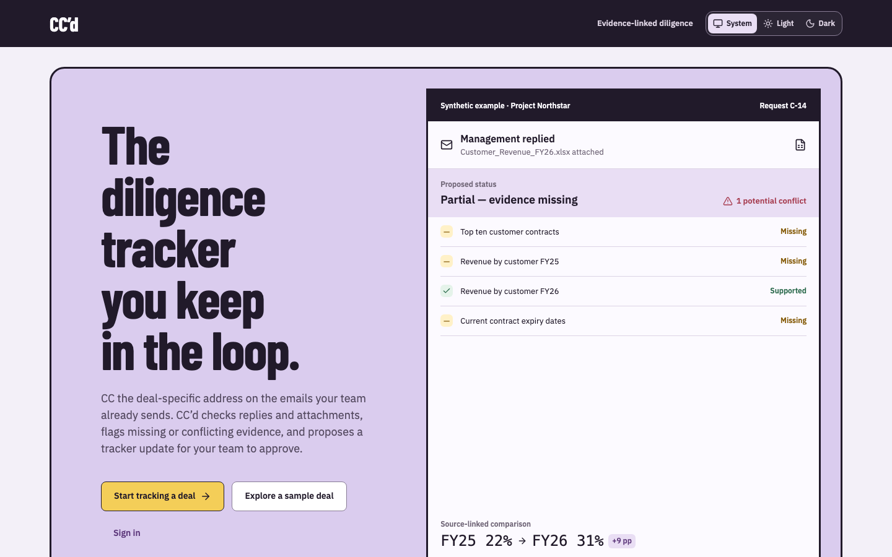

# CC'd

**CC a deal address on the diligence emails your team already sends. CC'd checks the replies and attachments against what was asked for, and proposes a tracker update for a person to approve.**

[Live demo →](https://ccd-ten.vercel.app) (includes a sample deal to explore)



## The problem

Private equity associates run diligence through ordinary email. They send requests, receive PDFs and spreadsheets back, and then update a separate tracker by hand across several workstreams at once. A reply arriving is easily mistaken for a question being answered. In reality the attachment may cover only part of the request, or contradict an earlier figure, and checking that is slow, manual work that gets skipped under deadline pressure.

## What it does

- **Routes each email to the right deal** through a unique deal address, so nobody has to forward or file anything.
- **Checks replies and attachments against the specific request,** marking each item as supported, partial or missing.
- **Flags conflicts,** for example a revenue figure that differs from an earlier source.
- **Links every piece of evidence to an exact location:** a file, page, sheet or cell range.
- **Proposes a tracker update for a person to approve.** Material changes always need human sign-off, and every decision is kept in a history.

<details>
<summary><strong>Tech stack & running locally</strong></summary>

**Stack:** Next.js, TypeScript, Tailwind CSS, Lucide icons. The demo uses a synthetic workspace (Acme Capital / Project Northstar) with prepared inputs and test accounts only.

Requires Node.js 22 and npm 10+.

```bash
cp .env.example .env.local
npm ci
npx playwright install chromium
npm run dev
```

Open http://localhost:3000. Routes: `/` landing, `/signup` onboarding, `/deals/new` deal setup and `/sample` the synthetic Northstar workspace. See [docs/DEMO.md](docs/DEMO.md) for the walkthrough.

Checks: `npm run lint`, `npm run typecheck`, `npm run test:domain`, `npm run build`, `npm run test:e2e`. GitHub Actions runs all of them on every push.

Product requirements are in [CC'd PRD.md](CC'd%20PRD.md); engineering decisions are recorded in [docs/DECISIONS.md](docs/DECISIONS.md).

</details>
